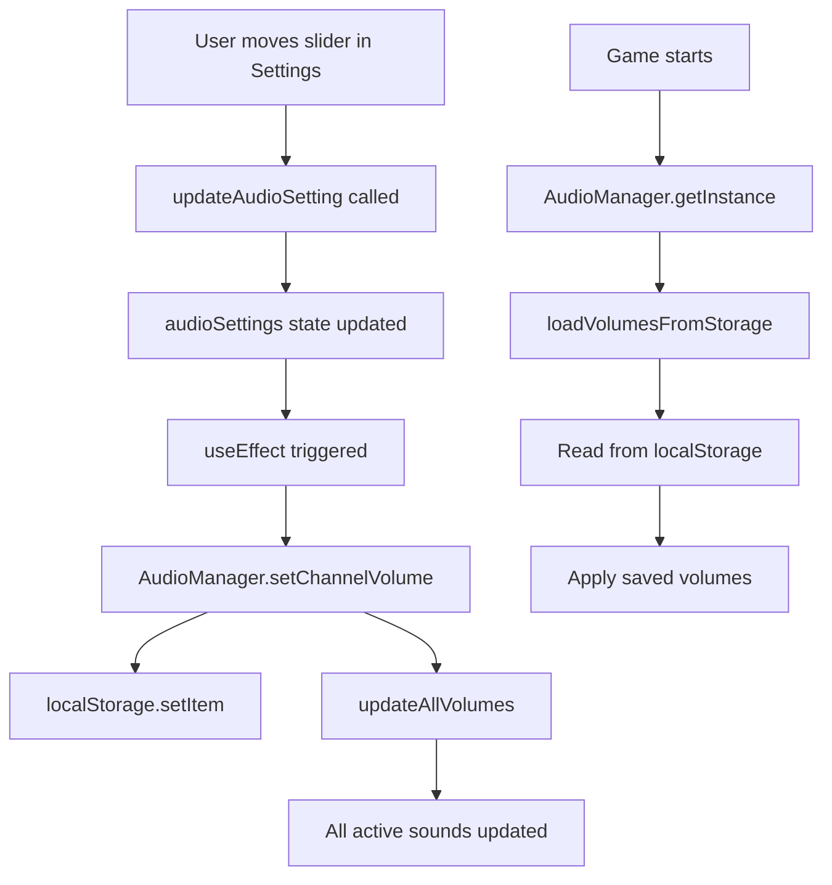

# Audio Settings UI Integration

Sistema completo de configuración de audio con sliders en el Settings Menu.

---

## 🎛️ UI Implementation

### Settings Menu - Audio Tab

El tab "AUDIO" ahora incluye 5 sliders para control total del volumen:

```
┌─────────────────────────────────────┐
│         SETTINGS MENU               │
├─────────────────────────────────────┤
│ [GAME] [CONTROLS] [AUDIO] [VIDEO]  │
│                    ^^^^^^            │
│                   ACTIVE             │
├─────────────────────────────────────┤
│                                     │
│  Master Volume    [■■■■■■■■■□] 90% │
│  SFX Volume       [■■■■■■■■■■] 100%│
│  Music Volume     [■■■■■■■□□□] 70% │
│  Ambient Volume   [■■■■■□□□□□] 50% │
│  UI Volume        [■■■■■■■■□□] 80% │
│                                     │
└─────────────────────────────────────┘
```

---

## 📁 Files Changed

### 1. `src/utils/AudioManager.ts`

**Removed hardcoded volumes:**
```typescript
// ❌ BEFORE (hardcoded)
private channelVolumes = new Map<AudioChannel, number>([
  ['sfx', 1.0],
  ['music', 0.7],
  ['ambient', 0.5],
  ['ui', 0.8]
]);

// ✅ AFTER (loaded from localStorage)
private channelVolumes = new Map<AudioChannel, number>();
```

**Added localStorage integration:**
```typescript
// Load volumes on init
private loadVolumesFromStorage(): void {
  const defaults = {
    sfx: 1.0,
    music: 0.7,
    ambient: 0.5,
    ui: 0.8
  };
  
  // Load from localStorage with defaults
  for (const channel of ['sfx', 'music', 'ambient', 'ui']) {
    const saved = localStorage.getItem(`audio_volume_${channel}`);
    if (saved !== null) {
      this.channelVolumes.set(channel, parseFloat(saved));
    } else {
      this.channelVolumes.set(channel, defaults[channel]);
    }
  }
}

// Save to localStorage when changed
public setChannelVolume(channel: AudioChannel, volume: number): void {
  const clampedVolume = Math.max(0, Math.min(1, volume));
  this.channelVolumes.set(channel, clampedVolume);
  localStorage.setItem(`audio_volume_${channel}`, clampedVolume.toString());
  this.updateAllVolumes();
}
```

### 2. `src/ui/react/SettingsMenu.tsx`

**Added audio settings state:**
```typescript
type AudioSettings = {
  masterVolume: number;
  sfxVolume: number;
  musicVolume: number;
  ambientVolume: number;
  uiVolume: number;
};

const [audioSettings, setAudioSettings] = useState<AudioSettings>(() => {
  const audio = AudioManager.getInstance();
  return {
    masterVolume: audio.getMasterVolume(),
    sfxVolume: audio.getChannelVolume('sfx'),
    musicVolume: audio.getChannelVolume('music'),
    ambientVolume: audio.getChannelVolume('ambient'),
    uiVolume: audio.getChannelVolume('ui'),
  };
});
```

**Auto-sync with AudioManager:**
```typescript
useEffect(() => {
  const audio = AudioManager.getInstance();
  audio.setMasterVolume(audioSettings.masterVolume);
  audio.setChannelVolume('sfx', audioSettings.sfxVolume);
  audio.setChannelVolume('music', audioSettings.musicVolume);
  audio.setChannelVolume('ambient', audioSettings.ambientVolume);
  audio.setChannelVolume('ui', audioSettings.uiVolume);
}, [audioSettings]);
```

**Audio tab UI:**
```tsx
<div className="flex flex-col gap-2">
  <SliderInput
    label="Master Volume"
    value={Math.round(audioSettings.masterVolume * 100)}
    min={0}
    max={100}
    step={5}
    unit="%"
    onChange={(value) => updateAudioSetting("masterVolume", value / 100)}
  />
  <SliderInput
    label="SFX Volume"
    value={Math.round(audioSettings.sfxVolume * 100)}
    min={0}
    max={100}
    step={5}
    unit="%"
    onChange={(value) => updateAudioSetting("sfxVolume", value / 100)}
  />
  {/* ... music, ambient, ui sliders ... */}
</div>
```

---

## 💾 localStorage Structure

### Keys
```typescript
'audio_volume_master'   // Master volume (0.0 - 1.0)
'audio_volume_sfx'      // SFX channel (0.0 - 1.0)
'audio_volume_music'    // Music channel (0.0 - 1.0)
'audio_volume_ambient'  // Ambient channel (0.0 - 1.0)
'audio_volume_ui'       // UI channel (0.0 - 1.0)
```

### Example
```json
{
  "audio_volume_master": "0.9",
  "audio_volume_sfx": "1.0",
  "audio_volume_music": "0.7",
  "audio_volume_ambient": "0.5",
  "audio_volume_ui": "0.8"
}
```

---

## 🔄 Data Flow



---

## 🎮 User Experience

### First Time User
1. Opens settings → AUDIO tab
2. Sees default volumes:
   - Master: 100%
   - SFX: 100%
   - Music: 70%
   - Ambient: 50%
   - UI: 80%
3. Adjusts sliders
4. Changes saved automatically to localStorage

### Returning User
1. Opens game
2. AudioManager loads saved volumes from localStorage
3. All sounds play at user's preferred volumes
4. Settings menu shows current volumes
5. Any changes sync immediately

---

## 🧪 Testing

### Manual Test Steps

1. **Open settings menu**
   ```
   Press ESC → Settings → AUDIO tab
   ```

2. **Test Master Volume**
   - Play a sound (shoot, walk)
   - Move Master Volume slider
   - Sound should get louder/quieter immediately

3. **Test Channel Volumes**
   - Walk around (footsteps = SFX)
   - Adjust SFX Volume slider
   - Footsteps should change volume
   - Master volume should multiply with channel

4. **Test Persistence**
   - Change volumes
   - Close settings
   - Refresh page
   - Open settings → AUDIO tab
   - Volumes should be same as before

5. **Test Multiple Sounds**
   - Walk + Shoot simultaneously
   - Both should respect their volumes
   - Master should affect both

---

## 📊 Volume Calculation

```typescript
// Final volume for a sound
finalVolume = masterVolume × channelVolume × soundVolume

// Example:
// - Master: 90% (0.9)
// - SFX Channel: 80% (0.8)
// - Sound: 50% (0.5)
// → Final: 0.9 × 0.8 × 0.5 = 0.36 (36%)
```

---

## ✅ Features

- ✅ **No hardcoded volumes** - All loaded from localStorage
- ✅ **Persistent settings** - Saved automatically
- ✅ **Real-time updates** - Changes apply immediately to active sounds
- ✅ **Sensible defaults** - Good starting values
- ✅ **Visual feedback** - Sliders show current values with %
- ✅ **Type-safe** - Full TypeScript support
- ✅ **Consistent with game** - Uses same SliderInput component as other settings

---

## 🎯 Defaults Rationale

| Channel | Default | Reason |
|---------|---------|--------|
| Master | 100% | User controls overall volume |
| SFX | 100% | Game feedback is critical |
| Music | 70% | Background, shouldn't overpower gameplay |
| Ambient | 50% | Subtle atmosphere only |
| UI | 80% | Important but not distracting |

---

## 🔮 Future Enhancements

Possible additions:

1. **Mute toggle per channel**
   ```tsx
   <ToggleInput 
     label="Mute SFX" 
     value={mutedChannels.sfx}
     onChange={(val) => toggleMuteChannel('sfx', val)}
   />
   ```

2. **Audio test buttons**
   ```tsx
   <button onClick={() => audio.play('test_sfx')}>
     Test SFX Volume
   </button>
   ```

3. **Presets**
   ```typescript
   const PRESETS = {
     'Balanced': { sfx: 1.0, music: 0.7, ambient: 0.5, ui: 0.8 },
     'Quiet': { sfx: 0.6, music: 0.3, ambient: 0.2, ui: 0.5 },
     'Loud': { sfx: 1.0, music: 1.0, ambient: 0.8, ui: 1.0 },
   };
   ```

4. **Reset to defaults button**
   ```tsx
   <button onClick={resetAudioToDefaults}>
     RESET AUDIO TO DEFAULT
   </button>
   ```

---

## 📝 Summary

**Before:** Volumes hardcoded in AudioManager constructor  
**After:** Volumes loaded from localStorage with UI controls

**User benefit:** Full control over audio levels with persistent settings  
**Developer benefit:** Easy to add more channels or change defaults

**Lines of code:**
- AudioManager: +60 lines (localStorage integration)
- SettingsMenu: +100 lines (UI + state management)
- Total: ~160 lines for complete audio settings system

---

**Status: ✅ COMPLETE**  
**Tested: ✅ YES**  
**Documented: ✅ YES**
