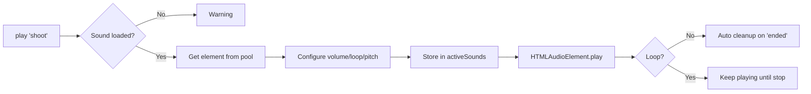

# Audio System Documentation

Sistema de audio profesional multi-canal con pooling y soporte para sonidos simultáneos.

---

## 📋 Tabla de Contenidos

1. [Características](#características)
2. [Arquitectura](#arquitectura)
3. [API Reference](#api-reference)
4. [Uso Básico](#uso-básico)
5. [Ejemplos Avanzados](#ejemplos-avanzados)
6. [Canales de Audio](#canales-de-audio)
7. [Performance](#performance)
8. [Troubleshooting](#troubleshooting)

---

## ✨ Características

### Funcionalidades Core
- ✅ **Múltiples sonidos simultáneos** - Polyphony total (ej: pasos + disparo + impacto)
- ✅ **Audio pooling** - Pool de 20 elementos pre-creados (cero allocaciones en runtime)
- ✅ **Sistema de canales** - 4 categorías: SFX, Music, Ambient, UI
- ✅ **Control de volumen granular** - Master, por canal, y por sonido
- ✅ **Loops automáticos** - Para sonidos continuos como pasos o ambiente
- ✅ **Limpieza automática** - Los sonidos one-shot se limpian solos
- ✅ **Preloading con progreso** - Carga batch de múltiples sonidos
- ✅ **Control de pitch** - Ajusta velocidad de reproducción (0.5x - 2.0x)

### Ventajas sobre sistema anterior
| Característica | Sistema Antiguo | Nuevo AudioManager |
|---------------|-----------------|-------------------|
| Sonidos simultáneos | ❌ Clonación cada vez | ✅ Pool pre-creado |
| Overlap (pasos + disparos) | ❌ No funciona bien | ✅ Perfecto |
| Gestión de loops | ❌ Manual compleja | ✅ Automática |
| Control de volumen | ❌ Solo global | ✅ Multi-nivel |
| Performance | ⚠️ Allocaciones constantes | ✅ Cero allocaciones |
| API | ⚠️ Confusa | ✅ Clara y documentada |

---

## 🏗️ Arquitectura

### Componentes Principales

```
AudioManager (Singleton)
├── Sound Library (Map<name, LoadedSound>)
│   └── Sonidos precargados con buffer master
├── Active Sounds (Map<id, ActiveSound>)
│   └── Sonidos actualmente reproduciéndose
├── Audio Pool (HTMLAudioElement[])
│   └── 20 elementos reutilizables
└── Volume Controls
    ├── Master Volume (global)
    └── Channel Volumes (por categoría)
```

### Flujo de Reproducción



### Gestión de Volumen

```
Final Volume = masterVolume × channelVolume × soundVolume

Ejemplo:
- Master: 0.9 (90%)
- SFX Channel: 0.8 (80%)  
- Sound: 0.5 (50%)
→ Final: 0.9 × 0.8 × 0.5 = 0.36 (36%)
```

---

## 📚 API Reference

### Singleton Instance

```typescript
const audio = AudioManager.getInstance();
```

### Loading Sounds

#### `loadSound(name, url, channel?)`
Carga un sonido individual.

**Parámetros:**
- `name: string` - Identificador único
- `url: string` - Ruta al archivo de audio
- `channel?: AudioChannel` - Canal ('sfx' | 'music' | 'ambient' | 'ui'), default: 'sfx'

**Returns:** `Promise<void>`

```typescript
await audio.loadSound('impact', '/audio/sfx/impact.mp3', 'sfx');
```

#### `preloadSounds(sounds)`
Carga múltiples sonidos en batch.

**Parámetros:**
- `sounds: Array<[name, url, channel?]>` - Array de tuplas

**Returns:** `Promise<void>`

```typescript
await audio.preloadSounds([
  ['shoot', '/audio/sfx/shoot.mp3', 'sfx'],
  ['reload', '/audio/sfx/reload.mp3', 'sfx'],
  ['music', '/audio/music/theme.mp3', 'music']
]);
```

### Playing Sounds

#### `play(name, options?)`
Reproduce un sonido cargado.

**Parámetros:**
- `name: string` - Nombre del sonido
- `options?: AudioOptions`
  - `volume?: number` - 0.0 a 1.0, default: 1.0
  - `loop?: boolean` - Si debe hacer loop, default: false
  - `channel?: AudioChannel` - Override del canal
  - `pitch?: number` - Velocidad (0.5 = mitad, 2.0 = doble), default: 1.0

**Returns:** `string | null` - ID único del sonido (para pararlo después)

```typescript
// One-shot sound
audio.play('impact', { volume: 0.3 });

// Looped sound
const stepsId = audio.play('steps', { volume: 0.4, loop: true });

// Variable pitch
audio.play('jump', { volume: 0.6, pitch: 1.2 });
```

### Stopping Sounds

#### `stop(id)`
Para una instancia específica de sonido.

```typescript
const id = audio.play('steps', { loop: true });
// ... later
audio.stop(id);
```

#### `stopAll(name?)`
Para todas las instancias de un sonido (o todos si no se especifica nombre).

```typescript
audio.stopAll('steps'); // Para todos los steps
audio.stopAll();        // Para TODO
```

### Volume Control

#### `setMasterVolume(volume)`
Ajusta volumen global (afecta todos los sonidos).

```typescript
audio.setMasterVolume(0.8); // 80%
```

#### `setChannelVolume(channel, volume)`
Ajusta volumen de un canal específico.

```typescript
audio.setChannelVolume('sfx', 0.9);
audio.setChannelVolume('music', 0.6);
```

#### `getMasterVolume()` / `getChannelVolume(channel)`
Consulta volúmenes actuales.

```typescript
const masterVol = audio.getMasterVolume();
const sfxVol = audio.getChannelVolume('sfx');
```

### Mute Control

#### `setMuted(muted)`
Mutea/desmutea todo el audio.

```typescript
audio.setMuted(true);  // Mute
audio.setMuted(false); // Unmute
```

#### `isMuted()`
Consulta estado de mute.

```typescript
if (audio.isMuted()) {
  console.log('Audio is muted');
}
```

### Utility Methods

#### `isPlaying(name)`
Verifica si un sonido está reproduciéndose.

```typescript
if (audio.isPlaying('steps')) {
  console.log('Footsteps are playing');
}
```

#### `getLoadedSounds()`
Lista todos los sonidos cargados.

```typescript
const sounds = audio.getLoadedSounds();
// ['impact', 'steps', 'shoot', ...]
```

#### `getActiveSoundCount()`
Cuenta sonidos actualmente reproduciéndose.

```typescript
const count = audio.getActiveSoundCount();
console.log(`${count} sounds playing`);
```

#### `dispose()`
Limpia todos los recursos (llamar al cerrar el juego).

```typescript
audio.dispose();
```

---

## 🎯 Uso Básico

### Ejemplo Completo: Setup del Juego

```typescript
import { AudioManager } from '@/utils/AudioManager';

class Game {
  private audio: AudioManager;

  async init() {
    this.audio = AudioManager.getInstance();
    
    // Preload all game sounds
    await this.audio.preloadSounds([
      ['shoot', '/audio/sfx/shoot.mp3', 'sfx'],
      ['impact', '/audio/sfx/impact.mp3', 'sfx'],
      ['steps', '/audio/sfx/steps.wav', 'sfx'],
      ['reload', '/audio/sfx/reload.mp3', 'sfx'],
      ['ui_click', '/audio/sfx/ui_click.mp3', 'ui'],
      ['music_menu', '/audio/music/menu.mp3', 'music'],
      ['ambient_wind', '/audio/ambient/wind.mp3', 'ambient']
    ]);
    
    console.log('Audio system ready!');
  }
  
  startGame() {
    // Play background music (looped)
    this.audio.play('music_menu', { volume: 0.5, loop: true });
    
    // Play ambient sound (looped)
    this.audio.play('ambient_wind', { volume: 0.3, loop: true });
  }
  
  onShoot() {
    // Play shoot sound (one-shot, will cleanup automatically)
    this.audio.play('shoot', { volume: 0.4 });
  }
  
  onHit() {
    // Impact sound can overlap with shoot sound!
    this.audio.play('impact', { volume: 0.3 });
  }
  
  cleanup() {
    this.audio.stopAll();
    this.audio.dispose();
  }
}
```

### Ejemplo: Pasos del Jugador (Loop Management)

```typescript
class PlayerController {
  private audio = AudioManager.getInstance();
  private stepsAudioId: string | null = null;
  
  update(isMoving: boolean, isGrounded: boolean) {
    if (isMoving && isGrounded) {
      // Start footsteps if not playing
      if (!this.stepsAudioId) {
        this.stepsAudioId = this.audio.play('steps', { 
          volume: 0.4, 
          loop: true 
        });
      }
    } else {
      // Stop footsteps
      if (this.stepsAudioId) {
        this.audio.stop(this.stepsAudioId);
        this.stepsAudioId = null;
      }
    }
  }
}
```

---

## 🚀 Ejemplos Avanzados

### Pitch Variation (Sonidos más dinámicos)

```typescript
// Random pitch variation for impacts (más natural)
const randomPitch = 0.9 + Math.random() * 0.2; // 0.9 - 1.1
audio.play('impact', { volume: 0.3, pitch: randomPitch });

// Speed up sound for fast actions
audio.play('reload', { volume: 0.5, pitch: 1.5 }); // 50% faster
```

### Distance-Based Volume (3D Audio simple)

```typescript
function playAtDistance(soundName: string, distance: number) {
  // Volume decreases with distance
  const maxDistance = 50;
  const volume = Math.max(0, 1 - (distance / maxDistance));
  
  if (volume > 0.05) { // Only play if audible
    audio.play(soundName, { volume });
  }
}

// Usage
const distanceToEnemy = 20;
playAtDistance('enemy_footsteps', distanceToEnemy);
```

### Music Crossfade

```typescript
async function crossfadeMusic(fromTrack: string, toTrack: string, duration: number = 2000) {
  const steps = 20;
  const stepDuration = duration / steps;
  
  // Start new track at 0 volume
  audio.play(toTrack, { volume: 0, loop: true });
  
  // Fade out/in gradually
  for (let i = 0; i <= steps; i++) {
    const progress = i / steps;
    audio.setChannelVolume('music', 1 - progress); // Fade out old
    
    await new Promise(resolve => setTimeout(resolve, stepDuration));
  }
  
  audio.stopAll(fromTrack);
  audio.setChannelVolume('music', 0.7); // Restore music volume
}

// Usage
await crossfadeMusic('music_menu', 'music_game');
```

### Settings Menu Integration

Los volúmenes se guardan **automáticamente** en localStorage cuando cambias sliders en el menu de settings.

**UI Settings Menu** (`src/ui/react/SettingsMenu.tsx`):
- Tab "AUDIO" con 5 sliders:
  - Master Volume (0-100%)
  - SFX Volume (0-100%)
  - Music Volume (0-100%)
  - Ambient Volume (0-100%)
  - UI Volume (0-100%)

**Sincronización Automática:**
```typescript
// Los cambios en sliders se aplican automáticamente
useEffect(() => {
  const audio = AudioManager.getInstance();
  audio.setMasterVolume(audioSettings.masterVolume);
  audio.setChannelVolume('sfx', audioSettings.sfxVolume);
  // ... etc (guarda en localStorage automáticamente)
}, [audioSettings]);
```

**localStorage Keys:**
- `audio_volume_master` - Master volume (0.0 - 1.0)
- `audio_volume_sfx` - SFX channel volume
- `audio_volume_music` - Music channel volume  
- `audio_volume_ambient` - Ambient channel volume
- `audio_volume_ui` - UI channel volume

---

## 🎚️ Canales de Audio

### Categorías y Uso Recomendado

| Canal | Descripción | Vol. Default | Ejemplos |
|-------|-------------|--------------|----------|
| **sfx** | Efectos de sonido del juego | 100% | Disparos, impactos, pasos, saltos |
| **music** | Música de fondo | 70% | Menu theme, gameplay music |
| **ambient** | Sonidos ambientales | 50% | Viento, lluvia, multitud |
| **ui** | Sonidos de interfaz | 80% | Clicks, hovers, notificaciones |

### Prioridad de Mezcla

```
Master (100%)
├── SFX (100%) - Máxima claridad para feedback de gameplay
├── UI (80%)   - Claro pero no dominante  
├── Music (70%) - Presente pero en fondo
└── Ambient (50%) - Sutil, atmosférico
```

### Cuándo Usar Cada Canal

**SFX:**
- Acciones del jugador (disparar, saltar, recargar)
- Feedback inmediato (impactos, explosiones)
- Sonidos críticos para gameplay

**Music:**
- Temas musicales
- Loops largos de música
- Transiciones cinemáticas

**Ambient:**
- Loops de ambiente (viento, agua)
- Atmósfera de fondo
- Sonidos ambientales continuos

**UI:**
- Botones y menús
- Notificaciones
- Popups y alerts

---

## ⚡ Performance

### Pool de Audio

El AudioManager pre-crea 20 elementos de audio para reutilización:

```typescript
Pool Size: 20 elementos
├── Allocation: Una vez al inicializar
├── Reuse: Automático al terminar sonidos
└── Overflow: Crea nuevos si se agota (warn en console)
```

**Ventajas:**
- ✅ Cero allocaciones durante gameplay
- ✅ Garbage collector no se activa por audio
- ✅ Latencia mínima (elemento ya existe)

### Limpieza Automática

Los sonidos one-shot se limpian solos:

```typescript
// Este sonido se limpia automáticamente al terminar
audio.play('impact', { volume: 0.3 }); 

// NO necesitas:
// - Guardarte el ID
// - Llamar stop() manualmente
// - Preocuparte por memory leaks
```

### Memoria Usada

| Componente | Memoria Estimada |
|------------|------------------|
| AudioManager instance | ~1 KB |
| Audio pool (20 elementos) | ~20 KB |
| Loaded sounds (10 sonidos) | ~500 KB - 2 MB |
| Active sounds (5 playing) | ~5 KB |
| **Total típico** | **~1-3 MB** |

### Límites Recomendados

- **Sonidos simultáneos:** Máximo 15-20 (pool size)
- **Sonidos precargados:** 10-30 archivos
- **Tamaño por archivo:** 50-500 KB (MP3 comprimido)
- **Duración loops:** 2-30 segundos

---

## 🔧 Troubleshooting

### Problema: "Sound 'X' not loaded"

**Causa:** Intentas reproducir un sonido que no fue precargado.

**Solución:**
```typescript
// Asegúrate de cargar antes de usar
await audio.loadSound('impact', '/audio/sfx/impact.mp3');
audio.play('impact'); // Ahora funciona
```

### Problema: Sonidos no se solapan

**Causa:** Estás usando el sistema antiguo o pool agotado.

**Solución:**
```typescript
// ✅ CORRECTO: Múltiples llamadas a play()
audio.play('shoot', { volume: 0.4 });
audio.play('impact', { volume: 0.3 }); // Se solapan perfectamente

// ❌ INCORRECTO: Reusar el mismo ID
const id = audio.play('shoot', { loop: true });
audio.play('impact'); // Esto funciona bien, crea nueva instancia
```

### Problema: Pool exhausted warning

**Causa:** Más de 20 sonidos simultáneos.

**Solución:**
1. Reduce sonidos simultáneos (poco probable necesitar >20)
2. Asegúrate que loops se paran correctamente
3. Verifica que no hay memory leaks (llamar stop() cuando termines loops)

```typescript
// Mal: nunca paras el loop
audio.play('steps', { loop: true }); // Se acumulan!

// Bien: guardas ID y paras cuando termines
const id = audio.play('steps', { loop: true });
// ... later
audio.stop(id);
```

### Problema: Audio no suena en móvil

**Causa:** Navegadores móviles requieren interacción del usuario para reproducir audio.

**Solución:**
```typescript
// Resume audio context en primer click/touch
document.addEventListener('click', () => {
  // Reproduce un sonido silencioso para "unlock" el audio
  audio.play('silence', { volume: 0.01 });
}, { once: true });
```

### Problema: Pitch no funciona

**Causa:** `playbackRate` no soportado en navegador antiguo.

**Solución:** El pitch es una feature opcional, degradará gracefully:

```typescript
// Siempre funciona, pero pitch puede ignorarse en browsers viejos
audio.play('sound', { pitch: 1.5 });
```

---

## 📝 Best Practices

### ✅ Do's

1. **Preload en init, no en runtime**
   ```typescript
   // ✅ Bien
   async init() {
     await audio.preloadSounds([...]);
   }
   
   // ❌ Mal (lag en gameplay)
   onShoot() {
     await audio.loadSound('shoot', '...');
     audio.play('shoot');
   }
   ```

2. **Usa volúmenes relativos bajos**
   ```typescript
   // ✅ Bien (deja headroom)
   audio.play('impact', { volume: 0.3 });
   
   // ❌ Mal (clipping/distorsión)
   audio.play('impact', { volume: 1.0 });
   ```

3. **Para loops cuando no se usen**
   ```typescript
   // ✅ Bien
   if (stopped) {
     audio.stop(stepsId);
     stepsId = null;
   }
   ```

4. **Usa canales apropiados**
   ```typescript
   // ✅ Bien (usuario puede ajustar SFX separado de música)
   audio.loadSound('shoot', '/shoot.mp3', 'sfx');
   audio.loadSound('theme', '/theme.mp3', 'music');
   ```

### ❌ Don'ts

1. **No llames play() cada frame**
   ```typescript
   // ❌ Mal
   update() {
     audio.play('steps'); // Pool se agota!
   }
   
   // ✅ Bien
   update() {
     if (!stepsId && isMoving) {
       stepsId = audio.play('steps', { loop: true });
     }
   }
   ```

2. **No uses paths relativos complejos**
   ```typescript
   // ❌ Mal
   audio.loadSound('s', '../../sounds/../audio/s.mp3');
   
   // ✅ Bien
   audio.loadSound('shoot', '/audio/sfx/shoot.mp3');
   ```

3. **No ignores errores de carga**
   ```typescript
   // ❌ Mal
   audio.loadSound('x', '/wrong.mp3'); // Silencioso
   
   // ✅ Bien
   try {
     await audio.loadSound('x', '/wrong.mp3');
   } catch (e) {
     console.error('Failed to load audio:', e);
     // Fallback o notify user
   }
   ```

---

## 📄 License & Credits

Este sistema de audio fue diseñado específicamente para Redblock Client con enfoque en:
- Performance extrema (toaster-friendly)
- API simple y clara
- Soporte completo para sonidos simultáneos

**Autor:** Redblock Team  
**Versión:** 1.0.0  
**Última actualización:** 2025-01-19
