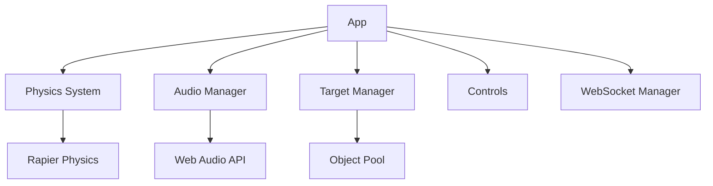
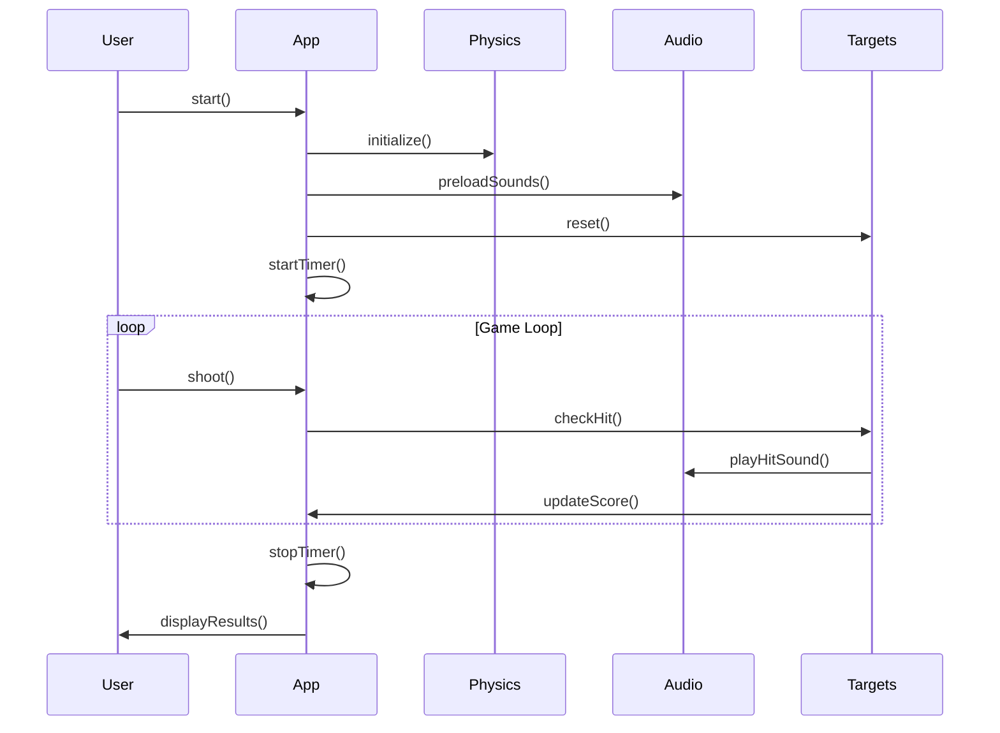

# App Class

The `App` class is the core of the Redblock game engine. It orchestrates all subsystems and manages the game lifecycle.

## Overview

Located at `/src/core/App.ts`, the App class is responsible for:

- Initializing and managing all game systems
- Running the game loop
- Handling player input and controls
- Managing game state and scenarios
- Coordinating between physics, audio, and rendering

## Architecture



## Key Responsibilities

### 1. System Initialization

The App initializes all subsystems in the correct order:

```typescript
constructor(ui?: UIController, options?: { disableServer?: boolean }) {
  this.ui = ui;
  this.isEditorMode = options?.disableServer ?? false;
  
  // Initialize systems
  this.audioManager = new AudioManager();
  this.collisionSystem = new PhysicsSystem(this.scene);
  this.targetManager = new TargetManager(this.scene);
  // ... more initialization
}
```

### 2. Game Loop

The App manages the main game loop through the `Loop` class:

- Updates physics simulation
- Processes player input
- Updates target states
- Renders the scene
- Manages audio playback

### 3. State Management

The App tracks various game states:

- `gameRunning`: Whether the game is active
- `paused`: Whether the game is paused
- `targets`: Array of active targets
- `completedGenerators`: Set of completed generator IDs

## Public API

### Methods

#### `start(): void`

Starts the game loop and initializes all systems.

```typescript
app.start();
```

#### `startTimer(): void`

Begins the game timer and activates targets.

```typescript
app.startTimer();
```

#### `stopTimer(): void`

Stops the game timer and displays results.

```typescript
app.stopTimer();
```

#### `shoot(): void`

Handles shooting action, performs raycasting, and processes hits.

```typescript
app.shoot();
```

### Properties

#### `scene: MainScene`

The Three.js scene containing all 3D objects.

#### `camera: Camera`

The first-person camera.

#### `controls: ControlsWithMovement`

Player movement and look controls.

#### `targets: Target[]`

Array of all active targets in the scene.

## Game Lifecycle



## Example Usage

### Basic Game Setup

```typescript
import { App } from '@/core/App';

// Create app instance
const app = new App(uiController, { disableServer: true });

// Start the game
app.start();

// Start a scenario
app.startTimer();
```

### Handling Events

```typescript
// Listen for game completion
app.on('gameComplete', (results) => {
  console.log('Game finished!', results);
});

// Handle target hits
app.on('targetHit', (target) => {
  console.log('Target hit!', target);
});
```

## Integration with Other Systems

### Physics System

The App uses the PhysicsSystem for:
- Character controller
- Collision detection
- Ground detection

### Audio Manager

The App uses the AudioManager for:
- Playing sound effects
- Managing background music
- Spatial audio

### Target Manager

The App uses the TargetManager for:
- Target pooling
- Target lifecycle management
- Spatial partitioning

## Performance Considerations

- Uses object pooling for targets
- Implements spatial partitioning for collision detection
- Lazy loads audio assets
- Disposes unused resources

## Best Practices

1. **Always dispose**: Call `dispose()` when done
2. **Use object pooling**: Don't create/destroy targets frequently
3. **Batch updates**: Update multiple targets in one frame
4. **Monitor performance**: Use the built-in performance metrics

## Troubleshooting

### Common Issues

**Issue**: Game doesn't start
- **Solution**: Check that all assets are loaded

**Issue**: Poor performance
- **Solution**: Reduce target count or enable object pooling

**Issue**: Audio not playing
- **Solution**: Ensure user interaction before playing audio

## Next Steps

- [EditorApp](/docs/core-concepts/editor-app) - Learn about the editor
- [Physics System](/docs/systems/physics) - Deep dive into physics
- [Audio Manager](/docs/systems/audio) - Audio system details
