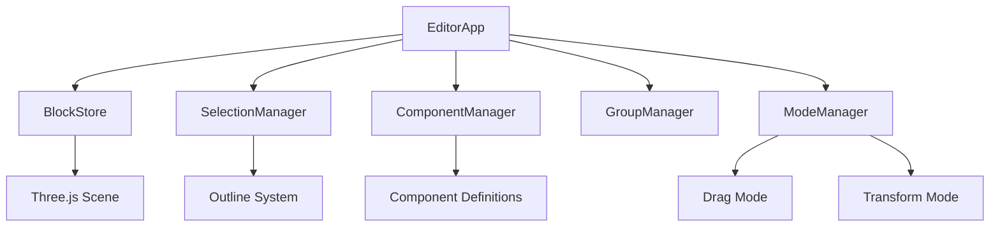

# EditorApp - Visual Scenario Editor

The EditorApp is a powerful visual editor for creating and managing aim training scenarios with a drag-and-drop interface.

## ✨ Features

- ✅ **Visual block placement** - Drag-and-drop 3D block editor
- ✅ **Target generators** - Place and configure target spawn points
- ✅ **Component system** - Create reusable prefabs
- ✅ **Scenario management** - Save, load, and export scenarios
- ✅ **Transform tools** - Move, rotate, and scale objects
- ✅ **Group management** - Group and ungroup blocks
- ✅ **Undo/redo system** - Full history tracking

## 🏗️ Architecture

### System Overview



### Core Managers

#### 1. **BlockStore**
Manages all blocks in the scene:
```typescript
private readonly blocks: BlockStore;
```

#### 2. **SelectionManager**
Handles block selection and outlines:
```typescript
private readonly selection: SelectionManager;
```

#### 3. **ComponentManager**
Manages reusable components:
```typescript
private readonly components: ComponentManager;
```

#### 4. **GroupManager**
Handles block grouping:
```typescript
private readonly groups: GroupManager;
```

## 📚 API Reference

### Block Placement

#### `placeBlockAt(clientX: number, clientY: number): EditorBlock | null`
Places a block at the cursor position.

```typescript
const block = editor.placeBlockAt(event.clientX, event.clientY);
```

#### `placeSpawnAt(clientX: number, clientY: number): EditorBlock | null`
Places a spawn point (only one allowed per scenario).

```typescript
const spawn = editor.placeSpawnAt(event.clientX, event.clientY);
```

#### `placeRandomTargetGeneratorAt(clientX: number, clientY: number): EditorBlock | null`
Places a target generator marker.

```typescript
const generator = editor.placeRandomTargetGeneratorAt(
  event.clientX,
  event.clientY
);
```

### Block Management

#### `removeBlock(id: string): boolean`
Removes a block from the scene.

```typescript
editor.removeBlock('block-1');
```

#### `getBlock(id: string): EditorBlock | undefined`
Gets a block by ID.

```typescript
const block = editor.getBlock('block-1');
```

#### `renameBlock(oldId: string, newId: string): boolean`
Renames a block.

```typescript
editor.renameBlock('block-1', 'floor');
```

### Selection

#### `pickBlock(clientX: number, clientY: number, additive: boolean): EditorBlock | null`
Selects a block at cursor position.

```typescript
// Single selection
const block = editor.pickBlock(x, y, false);

// Add to selection (Shift+Click)
const block = editor.pickBlock(x, y, true);
```

#### `getSelection(): EditorBlock | null`
Gets the currently selected block.

```typescript
const selected = editor.getSelection();
```

#### `getSelectionArray(): EditorBlock[]`
Gets all selected blocks.

```typescript
const blocks = editor.getSelectionArray();
```

#### `clearSelection(): void`
Clears the selection.

```typescript
editor.clearSelection();
```

### Transform Operations

#### `applyTransform(id: string, transform: SelectionTransform): boolean`
Applies a transform to a block.

```typescript
editor.applyTransform('block-1', {
  position: new THREE.Vector3(0, 1, 0),
  rotation: new THREE.Euler(0, Math.PI / 4, 0),
  scale: new THREE.Vector3(1, 1, 1)
});
```

#### `updateSelectedBlockPosition(position: Vector3): void`
Updates the selected block's position.

```typescript
editor.updateSelectedBlockPosition(new THREE.Vector3(5, 0, 5));
```

### Grouping

#### `groupSelection(): EditorBlock | null`
Groups selected blocks.

```typescript
const group = editor.groupSelection();
```

#### `ungroupSelected(): EditorBlock[] | null`
Ungroups the selected group.

```typescript
const blocks = editor.ungroupSelected();
```

### Components

#### `createComponentFromSelectedGroup(label: string, id: string): string | null`
Creates a reusable component from selected group.

```typescript
const componentId = editor.createComponentFromSelectedGroup(
  'Target Platform',
  'comp-1'
);
```

#### `placeComponentAt(clientX: number, clientY: number, component: SavedComponent): EditorBlock | null`
Places a component instance.

```typescript
const instance = editor.placeComponentAt(x, y, component);
```

#### `startEditingComponent(id: string): boolean`
Enters component edit mode.

```typescript
editor.startEditingComponent('comp-1');
```

#### `finishEditingComponent(id: string): boolean`
Exits component edit mode and saves changes.

```typescript
editor.finishEditingComponent('comp-1');
```

### Scenario Management

#### `exportScenario(name: string): SerializedScenario`
Exports the current scenario.

```typescript
const scenario = editor.exportScenario('My Scenario');
```

#### `importScenario(scenario: SerializedScenario): void`
Imports a scenario.

```typescript
editor.importScenario(loadedScenario);
```

#### `resetScene(): void`
Clears the entire scene.

```typescript
editor.resetScene();
```

## 🎯 Usage Examples

### Basic Editor Setup

```typescript
import EditorApp from '@/editor/EditorApp';

// Create editor
const canvas = document.getElementById('canvas') as HTMLCanvasElement;
const editor = new EditorApp(canvas);

// Start render loop
editor.start();
```

### Placing Blocks

```typescript
// Place a block on click
canvas.addEventListener('click', (event) => {
  const block = editor.placeBlockAt(event.clientX, event.clientY);
  if (block) {
    console.log('Placed block:', block.id);
  }
});
```

### Creating a Component

```typescript
// 1. Create and group some blocks
const block1 = editor.placeBlockAt(100, 100);
const block2 = editor.placeBlockAt(150, 100);

// 2. Select both
editor.setSelectionByIds([block1.id, block2.id]);

// 3. Group them
const group = editor.groupSelection();

// 4. Create component
const componentId = editor.createComponentFromSelectedGroup(
  'Double Platform',
  'comp-platform'
);

// 5. Place instances
const instance1 = editor.placeComponentAt(200, 200, component);
const instance2 = editor.placeComponentAt(300, 200, component);
```

### Saving and Loading

```typescript
// Export scenario
const scenario = editor.exportScenario('Training Map 1');

// Save to localStorage
localStorage.setItem('scenario', JSON.stringify(scenario));

// Load later
const loaded = JSON.parse(localStorage.getItem('scenario')!);
editor.importScenario(loaded);
```

### Generator Configuration

```typescript
// Place generator
const generator = editor.placeRandomTargetGeneratorAt(100, 100);

// Configure it
editor.updateGeneratorConfig(generator.id, {
  type: 'randomStatic',
  enabled: true,
  visible: true,
  count: 30,
  spawnRadius: 10,
  targetScale: 0.4,
  spawnHeight: 1.5,
  completionEvents: []
});
```

## 🎨 Editor Modes

### Drag Mode (Default)

- **Left Click**: Select block
- **Left Click + Drag**: Move selected blocks
- **Shift + Left Click**: Add to selection
- **Right Click + Drag**: Orbit camera

### Transform Mode

- **X/Y/Z Keys**: Constrain to axis
- **G**: Grab/move
- **R**: Rotate
- **S**: Scale

### Keyboard Shortcuts

| Key | Action |
|-----|--------|
| **G** | Grab (move) |
| **R** | Rotate |
| **S** | Scale |
| **X** | Constrain to X axis |
| **Y** | Constrain to Y axis |
| **Z** | Constrain to Z axis |
| **Delete** | Delete selected |
| **Ctrl+G** | Group selection |
| **Ctrl+Shift+G** | Ungroup |
| **Ctrl+D** | Duplicate |
| **Ctrl+Z** | Undo |
| **Ctrl+Shift+Z** | Redo |

## 🔧 Configuration

### Camera Settings

```typescript
// Camera position
editor.getCamera().position.set(8, 10, 14);

// Camera controls
const controls = editor.getControls();
controls.enableDamping = true;
controls.maxPolarAngle = Math.PI - 0.1;
```

### Scene Setup

```typescript
// Background color
editor.scene.background = new THREE.Color(0x3d3d3d);

// Lighting
const ambient = new THREE.AmbientLight(0xffffff, 0.5);
const directional = new THREE.DirectionalLight(0xffffff, 0.8);
```

## 📊 Scenario Format

### SerializedScenario

```typescript
type SerializedScenario = {
  version: 1;
  name: string;
  createdAt: string;
  blocks: SerializedNode[];
  componentDefinitions: SavedComponent[];
};
```

### SerializedNode

```typescript
type SerializedNode = {
  type: 'block' | 'group' | 'component';
  transform: SerializedTransform;
  name?: string;
  isSpawnPoint?: boolean;
  isGenerator?: boolean;
  generatorConfig?: GeneratorConfig;
  componentId?: string;
  children?: SerializedNode[];
};
```

## 🐛 Troubleshooting

### Blocks not appearing

**Cause:** Camera too far or blocks outside view

**Solution:**
```typescript
// Reset camera
editor.getCamera().position.set(8, 10, 14);
editor.getControls().target.set(0, 0, 0);
```

### Selection not working

**Cause:** Controls disabled or typing mode active

**Solution:**
```typescript
// Enable controls
editor.enableControls();

// Disable typing mode
editor.setTyping(false);
```

### Generator not saving config

**Cause:** Config not applied to userData

**Solution:**
```typescript
// Ensure config is in both places
block.generatorConfig = config;
block.mesh.userData.generatorConfig = config;
```

## 📈 Best Practices

### ✅ Do's

1. **Always dispose when done**
   ```typescript
   editor.dispose();
   ```

2. **Use components for repeated structures**
   ```typescript
   // Create once, place many times
   const component = createComponent('Platform');
   placeComponentAt(x1, y1, component);
   placeComponentAt(x2, y2, component);
   ```

3. **Validate before export**
   ```typescript
   editor.validateScene(); // Checks for spawn point, etc.
   ```

### ❌ Don'ts

1. **Don't modify blocks directly**
   ```typescript
   // ❌ Bad
   block.mesh.position.set(0, 0, 0);
   
   // ✅ Good
   editor.applyTransform(block.id, transform);
   ```

2. **Don't forget to clear selection**
   ```typescript
   // ❌ Bad - leaves selection active
   editor.placeBlockAt(x, y);
   
   // ✅ Good
   editor.clearSelection();
   editor.placeBlockAt(x, y);
   ```

## Next Steps

- [Component System](/docs/editor/components) - Creating reusable prefabs
- [Generator System](/docs/editor/generators) - Target spawn configuration
