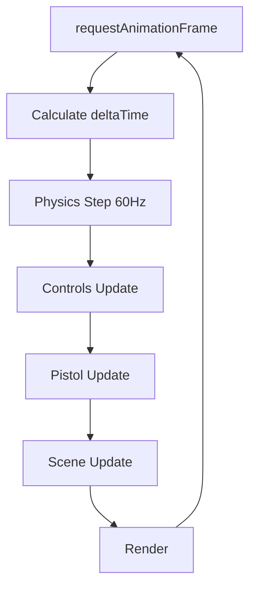

# Game Loop & Lifecycle

Understanding the Redblock game loop and lifecycle management for optimal performance and gameplay.

## ✨ Features

- ✅ **Fixed timestep physics** - Consistent simulation at 60Hz
- ✅ **Variable render rate** - Smooth visuals at any FPS
- ✅ **Frame rate limiting** - Prevents excessive GPU usage
- ✅ **Delta time management** - Frame-independent movement
- ✅ **Lifecycle hooks** - Clean initialization and cleanup

## 🏗️ Architecture



## 📚 Loop Class

Located at `/src/core/Loop.ts`:

```typescript
export class Loop {
  private renderer: EffectComposer;
  private scene: MainScene;
  private camera: THREE.Camera;
  private controls: ControlsWithMovement;
  private pistol: Pistol;
  private physicsSystem: PhysicsSystem;
  
  private active = false;
  private deltaTime = 0;
  private lastTime = performance.now();
  private lastRenderTime = 0;
  private frameCount = 0;
  
  // Frame rate limiting
  private readonly minFrameTime = 1000 / 144; // Max 144 FPS
}
```

## 🎯 Main Loop

### Animation Loop

```typescript
animate = () => {
  if (!this.active) return;

  const now = performance.now();
  
  // Frame rate limiter - skip frame if too soon
  if (now - this.lastRenderTime < this.minFrameTime) {
    requestAnimationFrame(this.animate);
    return;
  }
  
  // Calculate delta time
  this.deltaTime = (now - this.lastTime) / 1000;
  this.lastTime = now;
  this.lastRenderTime = now;
  this.frameCount++;
  
  // Clean up GSAP tweens periodically
  if (this.frameCount % 1200 === 0) {
    const gsap = (window as any).gsap;
    if (gsap) {
      gsap.ticker.tick();
    }
  }
  
  // Step physics BEFORE controls update
  this.physicsSystem.step(this.deltaTime);
  
  // Update game systems
  this.controls.update(this.deltaTime);
  this.pistol.update(this.deltaTime, this.camera);
  this.scene.update();
  
  // Render frame
  requestAnimationFrame(this.animate);
  this.renderer.render(this.deltaTime);
};
```

## ⚙️ Update Order

### Critical Order

1. **Physics Step** - Must run first for accurate collision detection
2. **Controls Update** - Uses physics results for movement
3. **Pistol Update** - Updates weapon animations
4. **Scene Update** - Updates scene objects
5. **Render** - Draws the frame

### Why This Order?

```typescript
// ✅ Correct order
this.physicsSystem.step(deltaTime);     // 1. Physics first
this.controls.update(deltaTime);        // 2. Then controls
this.pistol.update(deltaTime, camera);  // 3. Then weapons
this.scene.update();                    // 4. Then scene
this.renderer.render(deltaTime);        // 5. Finally render

// ❌ Wrong order - causes jitter
this.controls.update(deltaTime);        // Controls before physics
this.physicsSystem.step(deltaTime);     // Physics sees old position
```

## 🎮 App Lifecycle

### Initialization

```typescript
async init() {
  // 1. Initialize physics
  this.collisionSystem = new PhysicsSystem();
  await this.collisionSystem.waitForInit();
  
  // 2. Create scene
  this.scene = new MainScene(this.renderer, this.collisionSystem);
  
  // 3. Setup controls
  this.controls = new ControlsWithMovement(
    this.targets,
    this.camera,
    this.canvas,
    this.wsManager,
    () => this.getAmmountOfTargetsSelected(),
    this.collisionSystem
  );
  
  // 4. Create loop
  this.loop = new Loop(
    this.renderer,
    this.scene,
    this.camera,
    this.controls,
    this.pistol,
    this.collisionSystem
  );
}
```

### Start Game

```typescript
startGame() {
  if (this.gameRunning) return;
  
  // Enable physics
  this.collisionSystem.enablePhysics();
  
  // Lock pointer
  this.canvas.requestPointerLock();
  
  // Start loop
  this.loop.start();
  this.gameRunning = true;
  
  console.log('[App] Game started');
}
```

### Stop Game

```typescript
stopGame() {
  if (!this.gameRunning) return;
  
  // Disable physics
  this.collisionSystem.disablePhysics();
  
  // Release pointer
  document.exitPointerLock();
  
  // Stop loop
  this.loop.stop();
  this.gameRunning = false;
  
  console.log('[App] Game stopped');
}
```

### Cleanup

```typescript
dispose() {
  // Stop loop
  this.loop?.stop();
  
  // Dispose systems
  this.collisionSystem?.dispose();
  this.scene?.dispose();
  this.controls?.dispose();
  
  // Dispose renderer
  this.renderer?.dispose();
  
  console.log('[App] Disposed');
}
```

## ⏱️ Delta Time

### Usage

```typescript
// Frame-independent movement
update(deltaTime: number) {
  // Move at constant speed regardless of FPS
  position.x += velocity * deltaTime;
  
  // Rotate at constant rate
  rotation.y += angularVelocity * deltaTime;
}
```

### Clamping

```typescript
// Prevent spiral of death on slow frames
const clampedDelta = Math.min(deltaTime, 0.1); // Max 100ms
```

## 🔧 Physics Timestep

### Fixed Timestep Accumulator

```typescript
private readonly fixedTimeStep = 1 / 60; // 60Hz
private accumulator = 0;

step(deltaTime: number) {
  // Clamp to prevent spiral of death
  const clampedDelta = Math.min(deltaTime, 0.1);
  
  // Accumulate time
  this.accumulator += clampedDelta;
  
  // Step at fixed rate
  let stepsThisFrame = 0;
  const maxStepsPerFrame = 3;
  
  while (this.accumulator >= this.fixedTimeStep && 
         stepsThisFrame < maxStepsPerFrame) {
    this.world.step();
    this.accumulator -= this.fixedTimeStep;
    stepsThisFrame++;
  }
  
  // Discard excess time if too many steps
  if (stepsThisFrame >= maxStepsPerFrame) {
    this.accumulator = 0;
  }
}
```

### Benefits

- ✅ **Deterministic** - Same input = same output
- ✅ **Stable** - No physics explosions
- ✅ **Consistent** - Same behavior at any FPS
- ✅ **Efficient** - Skips steps when fast

## 📊 Performance Monitoring

### Frame Rate Limiting

```typescript
// Limit to 144 FPS to save power
private readonly minFrameTime = 1000 / 144;

if (now - this.lastRenderTime < this.minFrameTime) {
  requestAnimationFrame(this.animate);
  return; // Skip this frame
}
```

### GSAP Cleanup

```typescript
// Clean up completed tweens every 20 seconds
if (this.frameCount % 1200 === 0) {
  const gsap = (window as any).gsap;
  if (gsap) {
    gsap.ticker.tick();
  }
}
```

## 🎯 Usage Examples

### Basic Game Loop

```typescript
class Game {
  private loop: Loop;
  
  async init() {
    // Initialize systems
    await this.initSystems();
    
    // Create loop
    this.loop = new Loop(
      this.renderer,
      this.scene,
      this.camera,
      this.controls,
      this.pistol,
      this.physicsSystem
    );
  }
  
  start() {
    this.loop.start();
  }
  
  stop() {
    this.loop.stop();
  }
}
```

### Custom Update Logic

```typescript
class CustomSystem {
  update(deltaTime: number) {
    // Frame-independent logic
    this.timer += deltaTime;
    
    if (this.timer >= 1.0) {
      this.onSecondElapsed();
      this.timer = 0;
    }
  }
}
```

## 🐛 Troubleshooting

### Jittery movement

**Cause:** Physics running after controls

**Solution:**
```typescript
// ✅ Correct order
this.physicsSystem.step(deltaTime);
this.controls.update(deltaTime);
```

### Inconsistent speed

**Cause:** Not using deltaTime

**Solution:**
```typescript
// ❌ Bad
position.x += velocity;

// ✅ Good
position.x += velocity * deltaTime;
```

### Physics explosions

**Cause:** Variable timestep

**Solution:**
```typescript
// Use fixed timestep accumulator
this.physicsSystem.step(deltaTime); // Handles internally
```

### High CPU usage

**Cause:** No frame rate limit

**Solution:**
```typescript
// Add frame rate limiter
if (now - lastRenderTime < minFrameTime) {
  return; // Skip frame
}
```

## 📈 Best Practices

### ✅ Do's

1. **Use deltaTime for movement**
   ```typescript
   position.x += velocity * deltaTime;
   ```

2. **Clamp deltaTime**
   ```typescript
   const dt = Math.min(deltaTime, 0.1);
   ```

3. **Update physics first**
   ```typescript
   physicsSystem.step(deltaTime);
   controls.update(deltaTime);
   ```

4. **Limit frame rate**
   ```typescript
   if (now - lastFrame < minFrameTime) return;
   ```

### ❌ Don'ts

1. **Don't use fixed values**
   ```typescript
   // ❌ Bad
   position.x += 0.1;
   
   // ✅ Good
   position.x += velocity * deltaTime;
   ```

2. **Don't update physics after render**
   ```typescript
   // ❌ Bad order
   render();
   physicsSystem.step(deltaTime);
   ```

3. **Don't skip deltaTime clamping**
   ```typescript
   // ❌ Can cause spiral of death
   physicsSystem.step(deltaTime);
   
   // ✅ Clamp first
   physicsSystem.step(Math.min(deltaTime, 0.1));
   ```

## 🔗 Related

- [App Class](/docs/core-concepts/app) - Main application class
- [Physics System](/docs/systems/physics) - Physics integration
- [Performance](/docs/performance/optimization) - Optimization tips

## Next Steps

- [Performance Optimization](/docs/performance/optimization) - Improve FPS
- [Physics System](/docs/systems/physics) - Understand physics step
- [App Class](/docs/core-concepts/app) - Complete lifecycle
