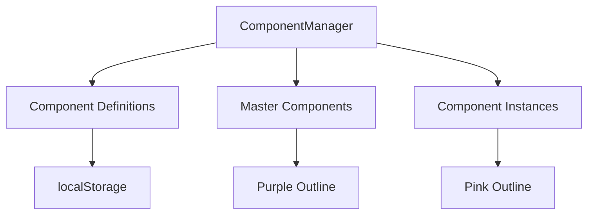

# Component System

The component system allows you to create reusable prefabs from groups of blocks, enabling efficient level design and consistent structures across scenarios.

## ✨ Features

- ✅ **Reusable Prefabs** - Create once, place many times
- ✅ **Component Editing** - Edit master, update all instances
- ✅ **Local Transforms** - Members positioned relative to component root
- ✅ **Visual Distinction** - Purple outlines for components
- ✅ **Persistent Storage** - Saved in localStorage
- ✅ **Scenario Integration** - Components saved with scenarios

## 🏗️ Architecture



## 📚 Component Types

### Component Definition

Stored definition of a component:

```typescript
type SavedComponent = {
  id: string;                      // e.g., 'comp-1'
  label: string;                   // Human-readable name
  members: ComponentMemberTransform[];
  category?: ComponentCategory;    // 'target' | 'obstacle' | 'platform'
};

type ComponentMemberTransform = {
  position: { x: number; y: number; z: number };
  rotation: { x: number; y: number; z: number };
  scale: { x: number; y: number; z: number };
};
```

### Runtime Component

Runtime state tracking:

```typescript
type RuntimeComponent = {
  id: string;
  label: string;
  groupId?: string;                // Master group ID
  editing: boolean;                // Currently being edited
  editingBasis?: Matrix4;          // Transform basis for editing
  masterChildIds: string[];        // IDs of blocks in edit mode
  instanceGroupIds: string[];      // IDs of all instances
  editingSourceId?: string;        // Source instance being edited
};
```

## 🎯 Usage Examples

### Creating a Component

```typescript
// 1. Create and select blocks
const block1 = editor.placeBlockAt(100, 100);
const block2 = editor.placeBlockAt(150, 100);
editor.setSelectionByIds([block1.id, block2.id]);

// 2. Group them
const group = editor.groupSelection();

// 3. Create component
const componentId = editor.createComponentFromSelectedGroup(
  'Target Platform',
  'comp-platform'
);

// Component is now saved and can be placed multiple times
```

### Placing Component Instances

```typescript
// Load component definition
const component = getComponent('comp-platform');

// Place instances
const instance1 = editor.placeComponentAt(200, 200, component);
const instance2 = editor.placeComponentAt(300, 200, component);
const instance3 = editor.placeComponentAt(400, 200, component);

// All instances share the same structure
```

### Editing a Component

```typescript
// 1. Select a component instance
editor.pickBlock(x, y, false);

// 2. Start editing
editor.startEditingComponent('comp-platform');

// 3. Modify blocks (move, rotate, scale, add, remove)
// All changes are tracked

// 4. Finish editing
editor.finishEditingComponent('comp-platform');

// All instances automatically update!
```

### Component Categories

```typescript
// Create categorized components
const targetPlatform = createComponent({
  label: 'Target Platform',
  category: 'target',
  members: [...]
});

const wall = createComponent({
  label: 'Wall Section',
  category: 'obstacle',
  members: [...]
});

const floor = createComponent({
  label: 'Floor Tile',
  category: 'platform',
  members: [...]
});
```

## 🎨 Visual Appearance

### Master Component (Purple)

```typescript
const MASTER_OUTLINE_COLOR = 0x9b5cff;  // Purple
```

When editing a component, blocks show purple outlines.

### Component Instance (Pink)

```typescript
const INSTANCE_OUTLINE_COLOR = 0xff4dff;  // Pink/Magenta
```

Placed component instances show pink outlines.

## 🔧 Implementation

### Creating from Selection

```typescript
public createComponentFromSelectedGroup(
  label: string, 
  id: string
): string | null {
  const selection = this.selection.getSelection();
  if (!selection || !(selection.mesh instanceof Group)) {
    return null;
  }

  const runtime = this.ensureRuntime({ id, label, members: [] });
  runtime.groupId = undefined;
  runtime.editing = false;
  runtime.editingBasis = undefined;
  runtime.masterChildIds = [];
  
  this.groupIdToComponentId.set(selection.id, id);
  selection.mesh.userData.componentId = id;
  selection.mesh.userData.componentRole = 'instance';
  
  this.blocks.setOutlineColor(
    selection.mesh, 
    ComponentManager.INSTANCE_OUTLINE_COLOR
  );
  
  if (!runtime.instanceGroupIds.includes(selection.id)) {
    runtime.instanceGroupIds.push(selection.id);
  }
  
  return id;
}
```

### Placing Instance

```typescript
public placeComponentAt(
  point: Vector3, 
  component: SavedComponent
): EditorBlock {
  const group = new Group();
  group.position.copy(point.setY(0.5));

  // Create member blocks
  component.members.forEach((member, index) => {
    const mesh = this.blocks.createPrimitiveBlockMesh();
    mesh.position.set(member.position.x, member.position.y, member.position.z);
    mesh.rotation.set(member.rotation.x, member.rotation.y, member.rotation.z);
    mesh.scale.set(member.scale.x, member.scale.y, member.scale.z);
    mesh.userData.componentMemberIndex = index;
    mesh.userData.componentRole = 'instance';
    group.add(mesh);
    
    this.blocks.setOutlineColor(mesh, INSTANCE_OUTLINE_COLOR);
  });

  const block = this.blocks.registerGroup(group);
  group.userData.componentId = component.id;
  group.userData.componentRole = 'instance';
  
  this.blocks.setOutlineColor(group, INSTANCE_OUTLINE_COLOR);
  this.groupIdToComponentId.set(block.id, component.id);

  const runtime = this.ensureRuntime(component);
  if (!runtime.instanceGroupIds.includes(block.id)) {
    runtime.instanceGroupIds.push(block.id);
  }

  return block;
}
```

### Syncing Edits

```typescript
public syncActiveComponentEdits(): void {
  const runtime = Array.from(this.components.values())
    .find((entry) => entry.editing && entry.editingBasis);
    
  if (!runtime || !runtime.editingBasis) return;

  const basisInverse = new Matrix4()
    .copy(runtime.editingBasis)
    .invert();
    
  const locals: LocalTransformSnapshot[] = [];

  // Extract local transforms from master
  for (let index = 0; index < runtime.masterChildIds.length; index++) {
    const childId = runtime.masterChildIds[index];
    const block = this.blocks.getBlock(childId);
    if (!block) continue;
    
    const child = block.mesh;
    child.updateWorldMatrix(true, false);
    
    const localMatrix = new Matrix4()
      .multiplyMatrices(basisInverse, child.matrixWorld);
      
    const position = new Vector3();
    const quaternion = new Quaternion();
    const scale = new Vector3();
    localMatrix.decompose(position, quaternion, scale);
    
    const rotation = new Euler().setFromQuaternion(quaternion);
    locals[index] = { position, rotation, scale };
  }

  // Save to definition
  const serialized: ComponentMemberTransform[] = locals.map((entry) => ({
    position: { x: entry.position.x, y: entry.position.y, z: entry.position.z },
    rotation: { x: entry.rotation.x, y: entry.rotation.y, z: entry.rotation.z },
    scale: { x: entry.scale.x, y: entry.scale.y, z: entry.scale.z },
  }));

  addComponent({ id: runtime.id, label: runtime.label, members: serialized });

  // Update all instances
  for (const groupId of runtime.instanceGroupIds) {
    const instanceBlock = this.blocks.getBlock(groupId);
    const group = instanceBlock?.mesh as Group | undefined;
    if (!group) continue;
    
    for (let i = 0; i < group.children.length && i < locals.length; i++) {
      const child = group.children[i];
      const snapshot = locals[i];
      child.position.copy(snapshot.position);
      child.rotation.copy(snapshot.rotation);
      child.scale.copy(snapshot.scale);
    }
  }
}
```

## 🎮 Workflow

### Component Creation Workflow

1. **Create blocks** - Place individual blocks
2. **Select blocks** - Multi-select with Shift+Click
3. **Group** - Press Ctrl+G or use menu
4. **Create component** - Name and save
5. **Place instances** - Drag from component panel

### Component Editing Workflow

1. **Select instance** - Click on any component instance
2. **Start editing** - Click "Edit Component" button
3. **Modify structure** - Add, remove, move blocks
4. **Finish editing** - Click "Finish Editing"
5. **All instances update** - Changes propagate automatically

## 🐛 Troubleshooting

### Component not updating instances

**Cause:** Not calling `syncActiveComponentEdits()`

**Solution:**
```typescript
// Call after any transform change during edit
editor.applyTransform(blockId, transform);
editor.components.syncActiveComponentEdits();
```

### Lost component reference

**Cause:** Component ID not in userData

**Solution:**
```typescript
// Ensure both places have ID
group.userData.componentId = componentId;
this.groupIdToComponentId.set(groupId, componentId);
```

### Can't edit component

**Cause:** Component not registered

**Solution:**
```typescript
// Check if component exists
const component = getComponent(componentId);
if (!component) {
  console.error('Component not found:', componentId);
}
```

## 📈 Best Practices

### ✅ Do's

1. **Use meaningful names**
   ```typescript
   createComponent('Target Platform');  // Good
   createComponent('comp-1');           // Bad
   ```

2. **Group related blocks**
   ```typescript
   // Platform with walls
   const platform = [floor, wall1, wall2, wall3];
   ```

3. **Test before saving**
   ```typescript
   // Verify structure works
   // Then create component
   ```

### ❌ Don'ts

1. **Don't nest components**
   ```typescript
   // ❌ Bad - components inside components not supported
   ```

2. **Don't edit multiple components simultaneously**
   ```typescript
   // ❌ Bad
   editor.startEditingComponent('comp-1');
   editor.startEditingComponent('comp-2');  // Will fail
   ```

3. **Don't forget to finish editing**
   ```typescript
   // ❌ Bad - leaves editor in edit mode
   editor.startEditingComponent('comp-1');
   // ... make changes ...
   // (forgot to call finishEditingComponent)
   ```

## 💾 Storage

### localStorage Format

```typescript
// Key: 'redblock.components'
[
  {
    id: 'comp-1',
    label: 'Target Platform',
    members: [
      {
        position: { x: 0, y: 0, z: 0 },
        rotation: { x: 0, y: 0, z: 0 },
        scale: { x: 1, y: 1, z: 1 }
      },
      // ... more members
    ],
    category: 'target'
  },
  // ... more components
]
```

### Scenario Integration

Components are saved with scenarios:

```typescript
type SerializedScenario = {
  version: 1;
  name: string;
  createdAt: string;
  blocks: SerializedNode[];
  componentDefinitions: SavedComponent[];  // Components used in scenario
};
```

## 🔗 Related

- [EditorApp](/docs/core-concepts/editor-app) - Component API
- [Grouping](/docs/editor/getting-started#grouping) - Group management
- [Generators](/docs/editor/generators) - Using components with generators

## Next Steps

- [Getting Started](/docs/editor/getting-started) - Editor basics
- [Generators](/docs/editor/generators) - Create target spawners
- [Events](/docs/editor/events) - Chain components with events
