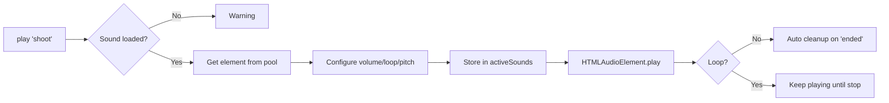

# Audio System

Professional multi-channel audio system with pooling and support for simultaneous sounds.

## ✨ Features

### Core Functionality
- ✅ **Multiple simultaneous sounds** - Full polyphony (e.g., footsteps + shooting + impact)
- ✅ **Audio pooling** - Pool of 20 pre-created elements (zero runtime allocations)
- ✅ **Channel system** - 4 categories: SFX, Music, Ambient, UI
- ✅ **Granular volume control** - Master, per-channel, and per-sound
- ✅ **Automatic loops** - For continuous sounds like footsteps or ambient
- ✅ **Automatic cleanup** - One-shot sounds clean themselves up
- ✅ **Preloading with progress** - Batch loading of multiple sounds
- ✅ **Pitch control** - Adjust playback speed (0.5x - 2.0x)

### Advantages over Previous System
| Feature | Old System | New AudioManager |
|---------|------------|------------------|
| Simultaneous sounds | ❌ Clone every time | ✅ Pre-created pool |
| Overlap (steps + shots) | ❌ Doesn't work well | ✅ Perfect |
| Loop management | ❌ Complex manual | ✅ Automatic |
| Volume control | ❌ Only global | ✅ Multi-level |
| Performance | ⚠️ Constant allocations | ✅ Zero allocations |
| API | ⚠️ Confusing | ✅ Clear and documented |

## 🏗️ Architecture

### Main Components

```
AudioManager (Singleton)
├── Sound Library (Map<name, LoadedSound>)
│   └── Preloaded sounds with master buffer
├── Active Sounds (Map<id, ActiveSound>)
│   └── Currently playing sounds
├── Audio Pool (HTMLAudioElement[])
│   └── 20 reusable elements
└── Volume Controls
    ├── Master Volume (global)
    └── Channel Volumes (per category)
```

### Playback Flow



### Volume Management

```
Final Volume = masterVolume × channelVolume × soundVolume

Example:
- Master: 0.9 (90%)
- SFX Channel: 0.8 (80%)  
- Sound: 0.5 (50%)
→ Final: 0.9 × 0.8 × 0.5 = 0.36 (36%)
```

## 📚 API Reference

### Singleton Instance

```typescript
const audio = AudioManager.getInstance();
```

### Loading Sounds

#### `loadSound(name, url, channel?)`
Loads an individual sound.

**Parameters:**
- `name: string` - Unique identifier
- `url: string` - Path to audio file
- `channel?: AudioChannel` - Channel ('sfx' | 'music' | 'ambient' | 'ui'), default: 'sfx'

**Returns:** `Promise<void>`

```typescript
await audio.loadSound('impact', '/audio/sfx/impact.mp3', 'sfx');
```

#### `preloadSounds(sounds)`
Loads multiple sounds in batch.

**Parameters:**
- `sounds: Array<[name, url, channel?]>` - Array of tuples

**Returns:** `Promise<void>`

```typescript
await audio.preloadSounds([
  ['shoot', '/audio/sfx/shoot.mp3', 'sfx'],
  ['reload', '/audio/sfx/reload.mp3', 'sfx'],
  ['music', '/audio/music/theme.mp3', 'music']
]);
```

### Playing Sounds

#### `play(name, options?)`
Plays a loaded sound.

**Parameters:**
- `name: string` - Sound name
- `options?: AudioOptions`
  - `volume?: number` - 0.0 to 1.0, default: 1.0
  - `loop?: boolean` - Whether to loop, default: false
  - `channel?: AudioChannel` - Channel override
  - `pitch?: number` - Playback speed (0.5 = half, 2.0 = double), default: 1.0

**Returns:** `string | null` - Unique sound ID (to stop it later)

```typescript
// One-shot sound
audio.play('impact', { volume: 0.3 });

// Looped sound
const stepsId = audio.play('steps', { volume: 0.4, loop: true });

// Variable pitch
audio.play('jump', { volume: 0.6, pitch: 1.2 });
```

### Stopping Sounds

#### `stop(id)`
Stops a specific sound instance.

```typescript
const id = audio.play('steps', { loop: true });
// ... later
audio.stop(id);
```

#### `stopAll(name?)`
Stops all instances of a sound (or all sounds if no name specified).

```typescript
audio.stopAll('steps'); // Stop all steps
audio.stopAll();        // Stop EVERYTHING
```

### Volume Control

#### `setMasterVolume(volume)`
Adjusts global volume (affects all sounds).

```typescript
audio.setMasterVolume(0.8); // 80%
```

#### `setChannelVolume(channel, volume)`
Adjusts volume of a specific channel.

```typescript
audio.setChannelVolume('sfx', 0.9);
audio.setChannelVolume('music', 0.6);
```

## 🎯 Basic Usage

### Complete Example: Game Setup

```typescript
import { AudioManager } from '@/utils/AudioManager';

class Game {
  private audio: AudioManager;

  async init() {
    this.audio = AudioManager.getInstance();
    
    // Preload all game sounds
    await this.audio.preloadSounds([
      ['shoot', '/audio/sfx/shoot.mp3', 'sfx'],
      ['impact', '/audio/sfx/impact.mp3', 'sfx'],
      ['steps', '/audio/sfx/steps.wav', 'sfx'],
      ['reload', '/audio/sfx/reload.mp3', 'sfx'],
      ['ui_click', '/audio/sfx/ui_click.mp3', 'ui'],
      ['music_menu', '/audio/music/menu.mp3', 'music'],
      ['ambient_wind', '/audio/ambient/wind.mp3', 'ambient']
    ]);
    
    console.log('Audio system ready!');
  }
  
  startGame() {
    // Play background music (looped)
    this.audio.play('music_menu', { volume: 0.5, loop: true });
    
    // Play ambient sound (looped)
    this.audio.play('ambient_wind', { volume: 0.3, loop: true });
  }
  
  onShoot() {
    // Play shoot sound (one-shot, will cleanup automatically)
    this.audio.play('shoot', { volume: 0.4 });
  }
  
  onHit() {
    // Impact sound can overlap with shoot sound!
    this.audio.play('impact', { volume: 0.3 });
  }
  
  cleanup() {
    this.audio.stopAll();
    this.audio.dispose();
  }
}
```

### Example: Player Footsteps (Loop Management)

```typescript
class PlayerController {
  private audio = AudioManager.getInstance();
  private stepsAudioId: string | null = null;
  
  update(isMoving: boolean, isGrounded: boolean) {
    if (isMoving && isGrounded) {
      // Start footsteps if not playing
      if (!this.stepsAudioId) {
        this.stepsAudioId = this.audio.play('steps', { 
          volume: 0.4, 
          loop: true 
        });
      }
    } else {
      // Stop footsteps
      if (this.stepsAudioId) {
        this.audio.stop(this.stepsAudioId);
        this.stepsAudioId = null;
      }
    }
  }
}
```

## 🎚️ Audio Channels

### Categories and Recommended Usage

| Channel | Description | Default Vol. | Examples |
|---------|-------------|--------------|----------|
| **sfx** | Game sound effects | 100% | Shots, impacts, footsteps, jumps |
| **music** | Background music | 70% | Menu theme, gameplay music |
| **ambient** | Ambient sounds | 50% | Wind, rain, crowd |
| **ui** | Interface sounds | 80% | Clicks, hovers, notifications |

### Mix Priority

```
Master (100%)
├── SFX (100%) - Maximum clarity for gameplay feedback
├── UI (80%)   - Clear but not dominant  
├── Music (70%) - Present but in background
└── Ambient (50%) - Subtle, atmospheric
```

## ⚡ Performance

### Audio Pool

The AudioManager pre-creates 20 audio elements for reuse:

```typescript
Pool Size: 20 elements
├── Allocation: Once at initialization
├── Reuse: Automatic when sounds finish
└── Overflow: Creates new if exhausted (warn in console)
```

**Advantages:**
- ✅ Zero allocations during gameplay
- ✅ Garbage collector not triggered by audio
- ✅ Minimum latency (element already exists)

### Automatic Cleanup

One-shot sounds clean themselves up:

```typescript
// This sound cleans up automatically when finished
audio.play('impact', { volume: 0.3 }); 

// You DON'T need to:
// - Save the ID
// - Call stop() manually
// - Worry about memory leaks
```

## 🔧 Troubleshooting

### Problem: "Sound 'X' not loaded"

**Cause:** Trying to play a sound that wasn't preloaded.

**Solution:**
```typescript
// Make sure to load before using
await audio.loadSound('impact', '/audio/sfx/impact.mp3');
audio.play('impact'); // Now it works
```

### Problem: Sounds don't overlap

**Cause:** Using old system or pool exhausted.

**Solution:**
```typescript
// ✅ CORRECT: Multiple play() calls
audio.play('shoot', { volume: 0.4 });
audio.play('impact', { volume: 0.3 }); // Overlaps perfectly

// ❌ INCORRECT: Reusing same ID
const id = audio.play('shoot', { loop: true });
audio.play('impact'); // This works fine, creates new instance
```

### Problem: Pool exhausted warning

**Cause:** More than 20 simultaneous sounds.

**Solution:**
1. Reduce simultaneous sounds (unlikely to need >20)
2. Ensure loops are stopped correctly
3. Verify no memory leaks (call stop() when done with loops)

```typescript
// Bad: never stop the loop
audio.play('steps', { loop: true }); // They accumulate!

// Good: save ID and stop when done
const id = audio.play('steps', { loop: true });
// ... later
audio.stop(id);
```

## 📝 Best Practices

### ✅ Do's

1. **Preload in init, not at runtime**
   ```typescript
   // ✅ Good
   async init() {
     await audio.preloadSounds([...]);
   }
   
   // ❌ Bad (lag in gameplay)
   onShoot() {
     await audio.loadSound('shoot', '...');
     audio.play('shoot');
   }
   ```

2. **Use low relative volumes**
   ```typescript
   // ✅ Good (leaves headroom)
   audio.play('impact', { volume: 0.3 });
   
   // ❌ Bad (clipping/distortion)
   audio.play('impact', { volume: 1.0 });
   ```

3. **Stop loops when not in use**
   ```typescript
   // ✅ Good
   if (stopped) {
     audio.stop(stepsId);
     stepsId = null;
   }
   ```

### ❌ Don'ts

1. **Don't call play() every frame**
   ```typescript
   // ❌ Bad
   update() {
     audio.play('steps'); // Pool gets exhausted!
   }
   
   // ✅ Good
   update() {
     if (!stepsId && isMoving) {
       stepsId = audio.play('steps', { loop: true });
     }
   }
   ```

## Next Steps

- [AudioManager API](/docs/api/audio-manager) - Complete API reference
- [Performance](/docs/performance/optimization) - Audio optimization techniques
- [App Class](/docs/core-concepts/app) - How App uses AudioManager
