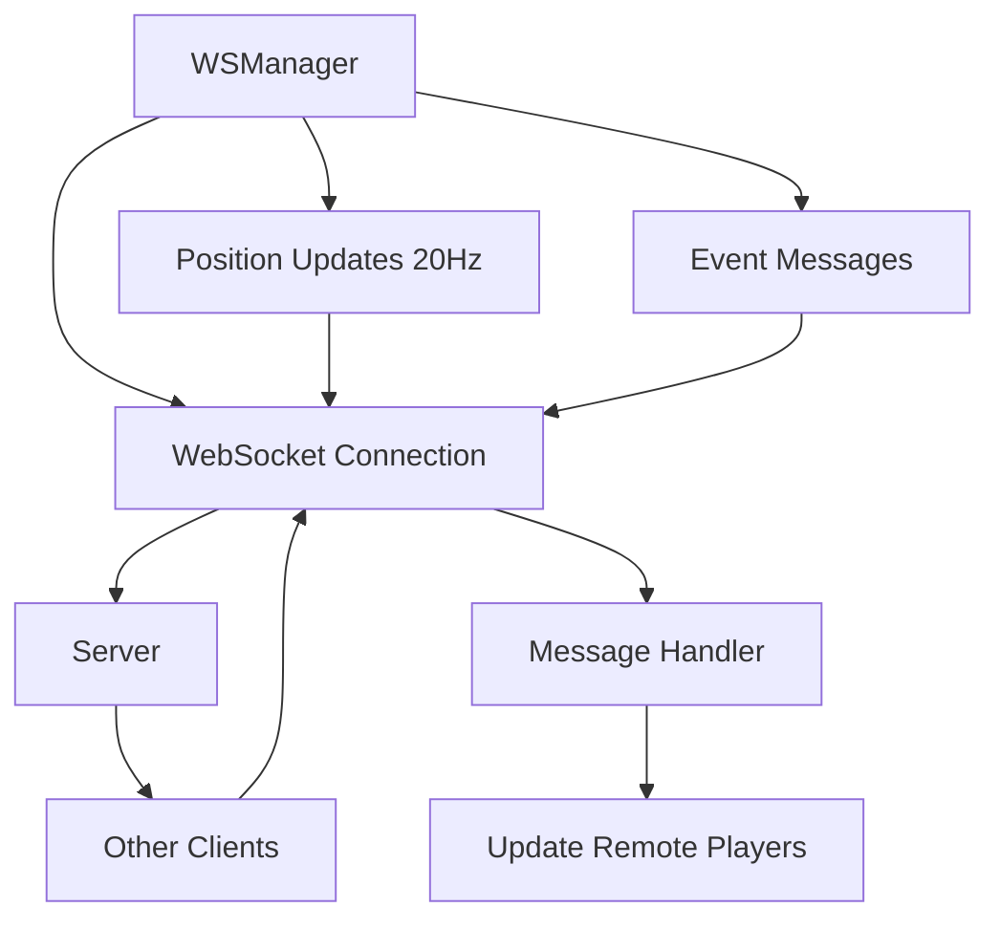

# Networking System

WebSocket-based multiplayer networking for real-time position synchronization and player interactions.

## ✨ Features

- ✅ **WebSocket Communication** - Real-time bidirectional messaging
- ✅ **Position Sync** - Smooth player position updates
- ✅ **Throttled Updates** - 20Hz update rate to save bandwidth
- ✅ **Quantization** - Reduced precision for smaller packets
- ✅ **Automatic Reconnection** - Handles connection drops
- ✅ **Room System** - Multiple game rooms support

## 🏗️ Architecture



## 📚 WSManager Class

### Core Structure

```typescript
export class WSManager {
  private ws: WebSocket | null = null;
  private url: string;
  private reconnectAttempts = 0;
  private maxReconnectAttempts = 5;
  private reconnectDelay = 1000;
  
  // Position sync
  private lastSentPosition = new Vector3();
  private lastSentRotation = 0;
  private updateTimer = 0;
  private updateInterval = 1 / 20; // 20Hz
  
  // Quantization
  private posQuant = 0.02;  // 2cm precision
  private rotQuant = 0.026; // ~1.5 degree precision
}
```

## 🔌 Connection Management

### Connecting

```typescript
connect(roomId?: string): Promise<void> {
  return new Promise((resolve, reject) => {
    const url = roomId 
      ? `${this.url}?room=${roomId}`
      : this.url;
      
    this.ws = new WebSocket(url);
    
    this.ws.onopen = () => {
      console.log('[WS] Connected');
      this.reconnectAttempts = 0;
      resolve();
    };
    
    this.ws.onerror = (error) => {
      console.error('[WS] Error:', error);
      reject(error);
    };
    
    this.ws.onclose = () => {
      console.log('[WS] Disconnected');
      this.handleDisconnect();
    };
    
    this.ws.onmessage = (event) => {
      this.handleMessage(event.data);
    };
  });
}
```

### Auto-Reconnection

```typescript
private handleDisconnect() {
  if (this.reconnectAttempts < this.maxReconnectAttempts) {
    this.reconnectAttempts++;
    
    console.log(`[WS] Reconnecting... (${this.reconnectAttempts}/${this.maxReconnectAttempts})`);
    
    setTimeout(() => {
      this.connect().catch(err => {
        console.error('[WS] Reconnect failed:', err);
      });
    }, this.reconnectDelay * this.reconnectAttempts);
  } else {
    console.error('[WS] Max reconnect attempts reached');
  }
}
```

### Disconnecting

```typescript
disconnect() {
  if (this.ws) {
    this.ws.close();
    this.ws = null;
  }
}
```

## 📡 Position Synchronization

### Sending Updates

```typescript
update(deltaTime: number, position: Vector3, rotation: number) {
  if (!this.ws || this.ws.readyState !== WebSocket.OPEN) {
    return;
  }
  
  this.updateTimer += deltaTime;
  
  // Throttle to 20Hz
  if (this.updateTimer < this.updateInterval) {
    return;
  }
  
  this.updateTimer = 0;
  
  // Check if position/rotation changed significantly
  const posChanged = position.distanceTo(this.lastSentPosition) > 0.08;
  const rotChanged = Math.abs(rotation - this.lastSentRotation) > 0.026;
  
  if (!posChanged && !rotChanged) {
    return; // No significant change
  }
  
  // Quantize values
  const quantPos = {
    x: Math.round(position.x / this.posQuant) * this.posQuant,
    y: Math.round(position.y / this.posQuant) * this.posQuant,
    z: Math.round(position.z / this.posQuant) * this.posQuant
  };
  
  const quantRot = Math.round(rotation / this.rotQuant) * this.rotQuant;
  
  // Send update
  this.send({
    type: 'position',
    position: quantPos,
    rotation: quantRot
  });
  
  // Update last sent values
  this.lastSentPosition.copy(position);
  this.lastSentRotation = rotation;
}
```

### Receiving Updates

```typescript
private handleMessage(data: string) {
  try {
    const message = JSON.parse(data);
    
    switch (message.type) {
      case 'position':
        this.handlePositionUpdate(message);
        break;
        
      case 'playerJoined':
        this.handlePlayerJoined(message);
        break;
        
      case 'playerLeft':
        this.handlePlayerLeft(message);
        break;
        
      case 'chat':
        this.handleChatMessage(message);
        break;
        
      default:
        console.warn('[WS] Unknown message type:', message.type);
    }
  } catch (error) {
    console.error('[WS] Failed to parse message:', error);
  }
}
```

## 🎮 Message Types

### Position Update

```typescript
type PositionMessage = {
  type: 'position';
  playerId: string;
  position: { x: number; y: number; z: number };
  rotation: number;
  timestamp: number;
};
```

### Player Joined

```typescript
type PlayerJoinedMessage = {
  type: 'playerJoined';
  playerId: string;
  username: string;
  position: { x: number; y: number; z: number };
  rotation: number;
};
```

### Player Left

```typescript
type PlayerLeftMessage = {
  type: 'playerLeft';
  playerId: string;
};
```

### Chat Message

```typescript
type ChatMessage = {
  type: 'chat';
  playerId: string;
  username: string;
  message: string;
  timestamp: number;
};
```

## 🎯 Usage Examples

### Basic Setup

```typescript
import { WSManager } from '@/networking/WSManager';

// Create manager
const wsManager = new WSManager('ws://localhost:8080');

// Connect
await wsManager.connect();

// Update in game loop
update(deltaTime: number) {
  const position = player.getPosition();
  const rotation = player.getRotation();
  
  wsManager.update(deltaTime, position, rotation);
}

// Disconnect on cleanup
dispose() {
  wsManager.disconnect();
}
```

### Room System

```typescript
// Join specific room
await wsManager.connect('room-123');

// Create new room
await wsManager.connect(); // Server assigns room ID
```

### Handling Remote Players

```typescript
class RemotePlayerManager {
  private players = new Map<string, RemotePlayer>();
  
  constructor(wsManager: WSManager) {
    wsManager.on('position', (msg) => {
      const player = this.players.get(msg.playerId);
      if (player) {
        player.updatePosition(msg.position, msg.rotation);
      }
    });
    
    wsManager.on('playerJoined', (msg) => {
      const player = new RemotePlayer(msg.playerId, msg.username);
      player.setPosition(msg.position);
      player.setRotation(msg.rotation);
      this.players.set(msg.playerId, player);
    });
    
    wsManager.on('playerLeft', (msg) => {
      const player = this.players.get(msg.playerId);
      if (player) {
        player.dispose();
        this.players.delete(msg.playerId);
      }
    });
  }
}
```

### Chat System

```typescript
// Send chat message
wsManager.send({
  type: 'chat',
  message: 'Hello world!'
});

// Receive chat messages
wsManager.on('chat', (msg) => {
  console.log(`${msg.username}: ${msg.message}`);
  addChatMessage(msg.username, msg.message);
});
```

## 🔧 Optimization Techniques

### Update Throttling

```typescript
// Only send updates at 20Hz instead of 60Hz
private updateInterval = 1 / 20;

update(deltaTime: number) {
  this.updateTimer += deltaTime;
  
  if (this.updateTimer < this.updateInterval) {
    return; // Skip this frame
  }
  
  this.updateTimer = 0;
  // Send update...
}
```

**Impact:** 67% reduction in network traffic

### Position Quantization

```typescript
// Quantize to 2cm precision
private posQuant = 0.02;

const quantized = Math.round(position.x / this.posQuant) * this.posQuant;
```

**Impact:** Smaller packets, less bandwidth

### Threshold-Based Updates

```typescript
// Only send if changed significantly
const posChanged = position.distanceTo(lastPos) > 0.08;
const rotChanged = Math.abs(rotation - lastRot) > 0.026;

if (posChanged || rotChanged) {
  sendUpdate();
}
```

**Impact:** 50-70% fewer updates when standing still

## 📊 Performance Metrics

### Network Usage

| Scenario | Updates/sec | Bandwidth |
|----------|-------------|-----------|
| **Standing Still** | 0 | 0 KB/s |
| **Walking** | 10-15 | 0.5-1 KB/s |
| **Running** | 20 | 1-2 KB/s |
| **10 Players** | 200 | 10-20 KB/s |

### Latency Targets

| Quality | Latency | Notes |
|---------|---------|-------|
| **Excellent** | < 50ms | LAN or nearby server |
| **Good** | 50-100ms | Regional server |
| **Acceptable** | 100-150ms | Cross-region |
| **Poor** | > 150ms | Noticeable lag |

## 🐛 Troubleshooting

### Connection fails

**Cause:** Server not running or wrong URL

**Solution:**
```typescript
// Check server is running
// Verify URL is correct
const wsManager = new WSManager('ws://localhost:8080');
```

### Players jittering

**Cause:** No interpolation on received positions

**Solution:**
```typescript
// Interpolate between positions
class RemotePlayer {
  private targetPosition = new Vector3();
  private currentPosition = new Vector3();
  
  updatePosition(newPos: Vector3) {
    this.targetPosition.copy(newPos);
  }
  
  update(deltaTime: number) {
    // Smooth interpolation
    this.currentPosition.lerp(this.targetPosition, deltaTime * 10);
    this.mesh.position.copy(this.currentPosition);
  }
}
```

### High bandwidth usage

**Cause:** Sending too many updates

**Solution:**
```typescript
// Increase update interval
private updateInterval = 1 / 15; // 15Hz instead of 20Hz

// Increase thresholds
const posChanged = position.distanceTo(lastPos) > 0.15; // 15cm
```

### Reconnection not working

**Cause:** Max attempts reached

**Solution:**
```typescript
// Increase max attempts
private maxReconnectAttempts = 10;

// Exponential backoff
private reconnectDelay = 1000 * Math.pow(2, this.reconnectAttempts);
```

## 📈 Best Practices

### ✅ Do's

1. **Throttle updates**
   ```typescript
   if (timer < updateInterval) return;
   ```

2. **Quantize values**
   ```typescript
   const quantized = Math.round(value / precision) * precision;
   ```

3. **Only send changes**
   ```typescript
   if (!hasChanged) return;
   ```

4. **Handle disconnections**
   ```typescript
   ws.onclose = () => this.reconnect();
   ```

### ❌ Don'ts

1. **Don't send every frame**
   ```typescript
   // ❌ Bad
   update() {
     sendPosition();
   }
   
   // ✅ Good
   update(deltaTime: number) {
     if (shouldSend(deltaTime)) {
       sendPosition();
     }
   }
   ```

2. **Don't send full precision**
   ```typescript
   // ❌ Bad
   { x: 1.23456789 }
   
   // ✅ Good
   { x: 1.24 } // Quantized
   ```

3. **Don't ignore connection state**
   ```typescript
   // ❌ Bad
   ws.send(data);
   
   // ✅ Good
   if (ws.readyState === WebSocket.OPEN) {
     ws.send(data);
   }
   ```

## 🔗 Related

- [App Class](/docs/core-concepts/app) - Integration with game
- [Performance](/docs/performance/optimization) - Network optimization
- [Game Loop](/docs/core-concepts/game-loop) - Update timing

## Next Steps

- [Performance Optimization](/docs/performance/optimization) - Reduce bandwidth
- [App Class](/docs/core-concepts/app) - Integrate networking
- [Best Practices](/docs/performance/best-practices) - Network patterns
