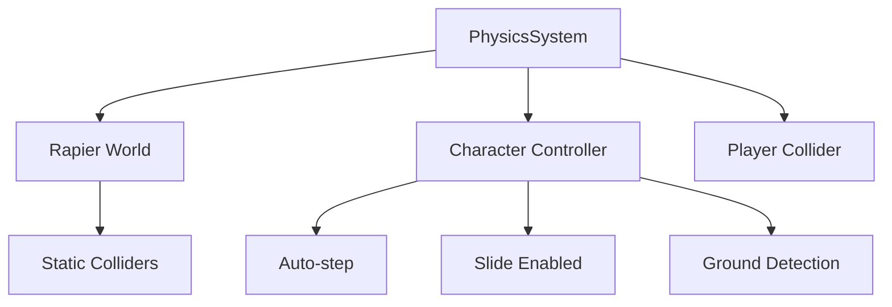

# Physics System - Rapier Integration

Redblock uses **Rapier3D** (`@dimforge/rapier3d-compat`) as its physics engine for realistic collision detection and character movement.

## ✨ Features

- ✅ **Realistic collision detection** - Powered by Rapier3D
- ✅ **Character controller** - First-person movement with auto-step and sliding
- ✅ **Gravity and dynamics** - Automatic gravity simulation
- ✅ **Ground detection** - Accurate grounded state tracking
- ✅ **Performance optimized** - Fixed timestep with reduced solver iterations
- ✅ **Smooth wall sliding** - No getting stuck on edges

## 🏗️ Architecture

### PhysicsSystem Class

Located at `/src/systems/PhysicsSystem.ts`, this class wraps Rapier3D and maintains API compatibility with the previous collision system.



### Key Components

#### 1. **Rapier World**
```typescript
// Physics world with gravity
const gravity = new RAPIER.Vector3(0.0, -24.0, 0.0);
this.world = new RAPIER.World(gravity);

// Optimized integration parameters
this.world.integrationParameters.numSolverIterations = 2;
this.world.integrationParameters.numInternalPgsIterations = 1;
```

#### 2. **Character Controller**
```typescript
// Create character controller with smooth collision handling
this.characterController = this.world.createCharacterController(0.01);
this.characterController.enableAutostep(0.2, 0.1, true);
this.characterController.setSlideEnabled(true);
```

#### 3. **Player Collider**
```typescript
// Capsule collider for smooth movement
const capsuleHalfHeight = (playerHeight - 2 * playerRadius) / 2;
const playerColliderDesc = RAPIER.ColliderDesc.capsule(
  capsuleHalfHeight,
  playerRadius
);
```

## 📚 API Reference

### Initialization

#### `constructor()`
Creates a new PhysicsSystem instance and initializes Rapier asynchronously.

```typescript
const physicsSystem = new PhysicsSystem();
await physicsSystem.waitForInit();
```

#### `waitForInit(): Promise<void>`
Waits for Rapier WASM to initialize.

```typescript
await physicsSystem.waitForInit();
console.log('Physics ready!');
```

### Player Configuration

#### `setPlayerDimensions(radius: number, height: number)`
Sets the player capsule dimensions.

**Parameters:**
- `radius: number` - Capsule radius (default: 0.25m)
- `height: number` - Total player height (default: 1.8m)

```typescript
physicsSystem.setPlayerDimensions(0.25, 1.8);
```

#### `setStepHeight(height: number)`
Sets the maximum step height the player can climb.

```typescript
physicsSystem.setStepHeight(0.2); // 20cm steps
```

#### `setPlayerPosition(position: Vector3)`
Teleports the player to a new position.

```typescript
physicsSystem.setPlayerPosition(new THREE.Vector3(0, 2, 0));
```

### Collider Management

#### `addCollider(box: CollisionBox): void`
Adds a static collision box to the world.

```typescript
const collider = {
  min: new THREE.Vector3(-5, 0, -5),
  max: new THREE.Vector3(5, 0.1, 5),
};
physicsSystem.addCollider(collider);
```

#### `addColliderFromObject(object: THREE.Object3D): CollisionBox`
Creates a collider from a Three.js object's bounding box.

```typescript
const collider = physicsSystem.addColliderFromObject(cube);
```

#### `removeCollider(collider: CollisionBox): void`
Removes a specific collider from the world.

```typescript
physicsSystem.removeCollider(collider);
```

#### `clearAll(): void`
Removes all colliders except the player.

```typescript
physicsSystem.clearAll();
```

### Movement and Collision

#### `slidePlayerAlongWalls(position: Vector3, movement: Vector3): Vector3`
Moves the player with collision detection and wall sliding.

**Parameters:**
- `position: Vector3` - Current player position
- `movement: Vector3` - Desired movement delta

**Returns:** `Vector3` - Corrected position after collision resolution

```typescript
const newPos = physicsSystem.slidePlayerAlongWalls(
  playerPos,
  new THREE.Vector3(0, 0, 1) // Move forward
);
```

#### `isGrounded(): boolean`
Checks if the player is on the ground.

```typescript
if (physicsSystem.isGrounded()) {
  console.log('Player is on ground');
}
```

#### `checkGroundCollision(position: Vector3, maxDistance: number): number | null`
Performs a raycast downward to find ground distance.

```typescript
const groundDist = physicsSystem.checkGroundCollision(
  playerPos,
  0.5 // Check up to 0.5m below
);
```

### Physics Simulation

#### `step(deltaTime: number): void`
Steps the physics simulation forward.

```typescript
// In game loop
physicsSystem.step(deltaTime);
```

#### `enablePhysics(): void` / `disablePhysics(): void`
Enables or disables physics simulation.

```typescript
physicsSystem.enablePhysics();  // Start simulation
physicsSystem.disablePhysics(); // Pause simulation
```

## 🎯 Usage Examples

### Basic Setup

```typescript
import { PhysicsSystem } from '@/systems/PhysicsSystem';

class Game {
  private physicsSystem: PhysicsSystem;

  async init() {
    // Create and initialize physics
    this.physicsSystem = new PhysicsSystem();
    await this.physicsSystem.waitForInit();
    
    // Configure player
    this.physicsSystem.setPlayerDimensions(0.25, 1.8);
    this.physicsSystem.setStepHeight(0.2);
    
    // Add ground
    this.physicsSystem.addCollider({
      min: new THREE.Vector3(-10, -0.1, -10),
      max: new THREE.Vector3(10, 0, 10)
    });
    
    // Enable physics
    this.physicsSystem.enablePhysics();
  }
  
  update(deltaTime: number) {
    // Step physics every frame
    this.physicsSystem.step(deltaTime);
  }
}
```

### Adding Level Geometry

```typescript
// Add colliders from editor blocks
const blocks = editorApp.getBlocks();
for (const block of blocks) {
  const collider = physicsSystem.addColliderFromObject(block.mesh);
}
```

### Player Movement with Physics

```typescript
class PlayerController {
  update(deltaTime: number) {
    // Calculate desired movement
    const movement = new THREE.Vector3();
    if (keys.forward) movement.z -= 1;
    if (keys.backward) movement.z += 1;
    if (keys.left) movement.x -= 1;
    if (keys.right) movement.x += 1;
    
    movement.normalize();
    movement.multiplyScalar(moveSpeed * deltaTime);
    
    // Apply movement with collision detection
    const newPos = physicsSystem.slidePlayerAlongWalls(
      playerPosition,
      movement
    );
    
    playerPosition.copy(newPos);
    
    // Check if grounded for jump logic
    if (physicsSystem.isGrounded() && keys.jump) {
      velocityY = jumpStrength;
    }
  }
}
```

## ⚙️ Configuration

### Physics Parameters

```typescript
// Gravity (m/s²)
const gravity = -24.0;

// Player dimensions
const playerRadius = 0.25;  // Smaller = less getting stuck
const playerHeight = 1.8;   // Eye level height

// Step height
const stepHeight = 0.2;     // Max climbable step (20cm)

// Solver iterations (performance vs accuracy)
const solverIterations = 2;  // Reduced for performance
```

### Character Controller Settings

```typescript
// Auto-step configuration
characterController.enableAutostep(
  0.2,   // Max step height
  0.1,   // Min width (smaller = smoother)
  true   // Include dynamic bodies
);

// Enable wall sliding
characterController.setSlideEnabled(true);

// Collision offset for smooth movement
const offset = 0.01;
```

## ⚡ Performance

### Fixed Timestep

The physics system uses a fixed timestep accumulator for stable simulation:

```typescript
private readonly fixedTimeStep = 1 / 60; // 60Hz
private accumulator = 0;

step(deltaTime: number) {
  this.accumulator += deltaTime;
  
  while (this.accumulator >= this.fixedTimeStep) {
    this.world.step();
    this.accumulator -= this.fixedTimeStep;
  }
}
```

### Optimization Techniques

1. **Reduced solver iterations** - 2 instead of 4 (50% faster)
2. **Fixed timestep** - Consistent simulation regardless of FPS
3. **Static colliders** - No overhead after creation
4. **Capsule collider** - Simpler than mesh colliders
5. **Minimal PGS iterations** - Faster convergence

### Memory Usage

| Component | Memory |
|-----------|--------|
| Rapier WASM | ~2 MB |
| Physics world | ~100 KB |
| Per collider | ~1 KB |
| Character controller | ~5 KB |

## 🔧 Troubleshooting

### Player falls through floor

**Cause:** Colliders added before Rapier initialized

**Solution:**
```typescript
await physicsSystem.waitForInit();
// Now add colliders
physicsSystem.addCollider(groundCollider);
```

### Player gets stuck on edges

**Cause:** Player radius too large

**Solution:**
```typescript
// Reduce player radius
physicsSystem.setPlayerDimensions(0.25, 1.8); // Smaller radius
```

### Jittery movement

**Cause:** Inconsistent deltaTime or snap-to-ground enabled

**Solution:**
```typescript
// Disable snap-to-ground in PhysicsSystem.ts
// this.characterController.enableSnapToGround(0.02); // Comment this out
```

### Poor performance

**Cause:** Too many solver iterations

**Solution:**
```typescript
// Already optimized to 2 iterations
// If still slow, check collider count
console.log(physicsSystem.getColliders().length);
```

## 📊 Comparison with Old System

| Feature | Old CollisionSystem | New PhysicsSystem |
|---------|---------------------|-------------------|
| **Engine** | Custom AABB | Rapier3D |
| **Gravity** | Manual | Automatic |
| **Sliding** | MTV-based | Character controller |
| **Performance** | Good for few objects | Scalable |
| **Realism** | Basic | High |
| **Detection** | Sampled capsule | Narrow-phase precise |

## 🔗 Integration

### With App.ts

```typescript
// App initialization
this.collisionSystem = new PhysicsSystem();
await this.collisionSystem.waitForInit();
this.collisionSystem.setPlayerDimensions(0.25, 1.8);

// Game loop
update(deltaTime: number) {
  this.collisionSystem.step(deltaTime);
  this.controls.update(deltaTime);
}
```

### With ControlsWithMovement.ts

```typescript
// Movement update
const newPos = this.collisionSystem.slidePlayerAlongWalls(
  this.yawObject.position,
  totalMovement
);

this.yawObject.position.copy(newPos);
this.onGround = this.collisionSystem.isGrounded();
```

### With Editor

```typescript
// Load scenario colliders
await app.collisionSystem.waitForInit();

blocks.forEach(block => {
  app.collisionSystem.addColliderFromObject(block.mesh);
});
```

## 📖 Resources

- [Rapier3D Documentation](https://rapier.rs/docs/)
- [Rapier3D.js API](https://rapier.rs/javascript3d/index.html)
- [Character Controller Guide](https://rapier.rs/docs/user_guides/javascript/character_controller)

## Next Steps

- [Controls System](/docs/systems/controls) - How controls use physics
- [App Class](/docs/core-concepts/app) - Physics integration in game loop
- [Performance](/docs/performance/optimization) - Physics optimization tips
