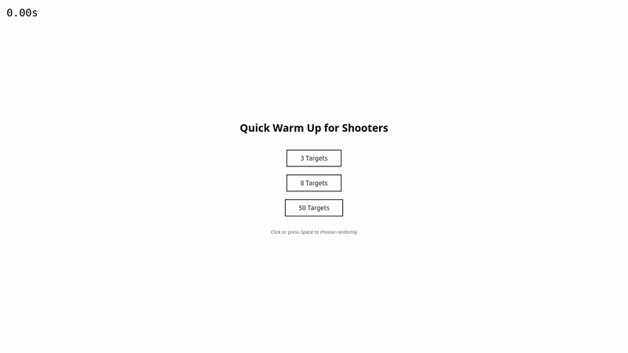

# 🎯 Redblock Online

**A multiplayer FPS aim trainer built with Three.js, Next.js, and TypeScript**

Redblock Online is a fast-paced 3D aim training game featuring a built-in world editor. Create custom training scenarios with blocks and spawn points, then jump straight into the action to improve your shooting accuracy and reaction time.

<h3 align="center">🎮 Game Preview</h3>

<p align="center">
  
</p>

## 📖 About the Project

Redblock Online combines two powerful experiences in one application:

### 🎮 **Game Mode**
- **FPS Aim Training**: Practice your aim with procedurally generated targets or custom maps
- **Custom Maps**: Load pre-designed scenarios from `.rbonline` files
- **Target Generators**: Dynamic target spawning with event-driven progression
- **Multiple Difficulty Levels**: Choose from 3, 8, or 50 targets for quick warm-ups or intense sessions
- **Real-time Performance Tracking**: Built-in timer tracks your completion time
- **Smooth Movement**: WASD controls with adjustable mouse sensitivity and inertia
- **Modern Graphics**: Cell-shaded visuals with post-processing effects (FXAA, outline rendering)

### 🛠️ **World Editor**
- **Visual Level Designer**: Drag-and-drop interface to build custom training scenarios
- **Target Generators**: Place generators that spawn targets dynamically with configurable bounds
- **Event System**: Chain generators together with onComplete events for progressive challenges
- **Component System**: Create reusable prefabs from grouped blocks
- **Transform Tools**: Move (G), Rotate (R), and Scale (F) with axis constraints (X/Y/Z)
- **Undo/Redo System**: Full history stack for safe experimentation
- **Scenario Management**: Save, load, and export custom worlds as `.rbonline` files
- **Spawn Point System**: Place cyan spawn points to define player starting positions
- **Play Mode**: Test your scenarios directly in the editor before saving

### 🌐 **Multiplayer Ready**
- WebSocket integration for real-time multiplayer (server implementation required)
- Player position and rotation synchronization
- Interpolation system for smooth remote player movement

---

## 🚀 Quick Start

### Installation

```bash
npm install
```

### Development

```bash
npm run dev
```

Open [http://localhost:3000](http://localhost:3000) to play the game, or visit [http://localhost:3000/editor](http://localhost:3000/editor) to access the world editor.

### Production Build

```bash
npm run build
npm start
```

---

## 🎮 Gameplay & Controls

| Action              | Key/Mouse             |
| ------------------- | --------------------- |
| Move Forward / Back | `W` / `S`             |
| Strafe Left / Right | `A` / `D`             |
| Shoot               | `Left Click`          |
| Crouch              | `C` (hold)            |
| Jump                | `Space`               |
| Lock Pointer        | `Click` inside canvas |
| Start Round         | `Space`               |

Use the **sensitivity slider** in the start screen to fine-tune mouse sensitivity. The value is stored in `localStorage` so your preference persists across sessions.

## 🎨 Editor Controls

| Action                  | Key/Mouse                    |
| ----------------------- | ---------------------------- |
| Select Block            | `Left Click`                 |
| Multi-Select            | `Shift/Ctrl + Left Click`    |
| Move Block              | `G` (then move mouse)        |
| Rotate Block            | `R` (then move mouse)        |
| Scale Block             | `F` (then move mouse)        |
| Constrain to Axis       | `X` / `Y` / `Z` (during transform) |
| Confirm Transform       | `Left Click` or `Enter`      |
| Cancel Transform        | `Esc`                        |
| Orbit Camera            | `Right Click + Drag`         |
| Pan Camera              | `Shift + Right Click + Drag` |
| Zoom Camera             | `Mouse Wheel`                |
| Move Camera             | `W` / `A` / `S` / `D`        |
| Copy Selection          | `Ctrl/Cmd + C`               |
| Paste                   | `Ctrl/Cmd + V`               |
| Delete Selection        | `Delete` or `Backspace`      |
| Undo                    | `Ctrl/Cmd + Z`               |
| Redo                    | `Ctrl/Cmd + Y` or `Cmd + Shift + Z` |
| Save Scenario           | `Ctrl/Cmd + S`               |

## ✨ Key Features

### Game Features
- **Three Target Presets**: Choose 3, 8, or 50 targets for different difficulty levels
- **Procedural Generation**: Colored cubes spawn randomly in the play area
- **Hit Detection**: Raycasting-based shooting with visual feedback
- **Animated Effects**: Target absorption animation when hit
- **Cell-Shaded Graphics**: Modern low-poly aesthetic with outline rendering
- **Performance Timer**: Automatic timing from first to last target
- **Adjustable Sensitivity**: Mouse sensitivity slider with localStorage persistence

### Editor Features
- **Drag & Drop Placement**: Intuitive block and spawn point placement
- **Transform Gizmos**: Visual feedback for move, rotate, and scale operations
- **Component System**: Group blocks into reusable prefabs
- **History Stack**: Unlimited undo/redo for all operations
- **Scenario Management**: Save, load, import, and export custom worlds
- **Auto-Save**: Automatic saving to prevent data loss
- **Multi-Selection**: Select and transform multiple blocks at once
- **Clipboard**: Copy/paste blocks with automatic offset

### Technical Features
- **TypeScript**: Full type safety throughout the codebase
- **Three.js**: Modern WebGL rendering with post-processing
- **Next.js App Router**: Server-side rendering and optimized bundling
- **WebSocket Ready**: Infrastructure for multiplayer gameplay
- **Modular Architecture**: Clean separation of concerns with systems and components

## 🗂️ Project Structure

```text
redblock-client/
├── app/
│   ├── page.tsx                    # Game route (/)
│   └── editor/
│       └── page.tsx                # Editor route (/editor)
├── public/
│   ├── models/
│   │   └── pistol.glb              # Low-poly pistol 3D model
│   ├── preview.gif                 # Gameplay preview
│   └── controls.png                # Control hints image
├── src/
│   ├── core/                       # Game engine core
│   │   ├── App.ts                  # Main game application
│   │   ├── Camera.ts               # Camera wrapper
│   │   ├── Renderer.ts             # WebGL renderer with post-processing
│   │   └── Loop.ts                 # Game loop manager
│   ├── editor/                     # World editor
│   │   ├── EditorApp.ts            # Editor application
│   │   ├── components/             # React UI components
│   │   ├── core/                   # Editor core systems
│   │   │   ├── BlockStore.ts       # Block management
│   │   │   ├── SelectionManager.ts # Selection system
│   │   │   ├── GroupManager.ts     # Grouping system
│   │   │   ├── ComponentManager.ts # Prefab system
│   │   │   ├── EditorModeManager.ts # Mode state machine
│   │   │   ├── InputRouter.ts      # Input event routing
│   │   │   └── handlers/           # Input handlers (drag, transform, selection)
│   │   ├── hooks/                  # React hooks
│   │   └── types.ts                # TypeScript definitions
│   ├── next/                       # Next.js bootstrappers
│   │   ├── GameBootstrapper.tsx    # Game initialization
│   │   └── EditorBootstrapper.tsx  # Editor initialization
│   ├── objects/                    # 3D objects
│   │   ├── Cube.ts                 # Target cube
│   │   ├── Pistol.ts               # Player weapon
│   │   └── generators/             # Procedural generation
│   ├── scenes/                     # Three.js scenes
│   │   └── MainScene.ts            # Main game scene
│   ├── systems/                    # Game systems
│   │   ├── ControlsWithMovement.ts # Player movement
│   │   └── movement/               # Movement components
│   ├── ui/                         # Game UI
│   │   └── react/                  # React components
│   └── utils/                      # Utilities
│       └── ws/                     # WebSocket client
├── package.json
├── tsconfig.json
└── next.config.ts
```

## 🛠️ Tech Stack

### Core Technologies
- **[Three.js](https://threejs.org/)** (r168) – WebGL rendering engine
- **[TypeScript](https://www.typescriptlang.org/)** (5.x) – Type-safe JavaScript
- **[Next.js](https://nextjs.org/)** (15.x) – React framework with App Router
- **[React](https://react.dev/)** (19.x) – UI library

### Three.js Addons
- **EffectComposer** – Post-processing pipeline
- **OutlinePass** – Object outline rendering
- **FXAAShader** – Anti-aliasing
- **OrbitControls** – Camera controls for editor

### Additional Libraries
- **GLTFLoader** – 3D model loading
- **WebSocket** – Real-time multiplayer communication

## 🔧 Configuration

### Game Settings

| Setting           | Location                              | Description                                                     |
| ----------------- | ------------------------------------- | --------------------------------------------------------------- |
| Mouse Sensitivity | `localStorage.mouseSensitivity`       | Adjustable via slider on start screen (0.1 - 2.0)               |
| WebSocket Server  | `NEXT_PUBLIC_WS_SERVER` env variable  | Override default WebSocket URL for multiplayer                  |
| Renderer Quality  | `src/core/Renderer.ts`                | Antialias, pixel ratio, shadow settings                         |
| Target Counts     | `src/scenes/MainScene.ts`             | Modify `level1/2/3()` methods for different cube counts         |

### Editor Settings

| Setting           | Location                              | Description                                                     |
| ----------------- | ------------------------------------- | --------------------------------------------------------------- |
| Auto-Save         | `src/editor/components/EditorRoot.tsx`| Automatic scenario saving after changes                         |
| Scenario Storage  | `localStorage`                        | Scenarios saved as JSON in browser storage                      |
| Grid Snapping     | `src/editor/EditorApp.ts`             | Currently disabled, can be enabled for precise placement        |

## 📜 Available NPM Scripts

| Script            | Purpose                               |
| ----------------- | ------------------------------------- |
| `npm run dev`     | Local dev server on `localhost:3000`. |
| `npm run build`   | Create an optimized production build. |
| `npm start`       | Run the production build locally.     |

## 📦 Assets

- **`public/models/pistol.glb`** – Low-poly pistol 3D model with cell-shaded material
- **`preview.gif`** – Gameplay preview animation used in this README
- **`controls.png`** – Keyboard/mouse control legend displayed in game HUD

## 🎯 How to Use the Editor

1. **Start the Editor**: Navigate to [http://localhost:3000/editor](http://localhost:3000/editor)
2. **Place Blocks**: Drag "Block" from the left panel onto the canvas
3. **Add Spawn Point**: Drag "Spawn Point" (cyan sphere) to set player start position
4. **Transform Objects**: 
   - Press `G` to move, `R` to rotate, `F` to scale
   - Press `X`, `Y`, or `Z` to constrain to an axis
   - Click or press `Enter` to confirm
5. **Create Components**: 
   - Select multiple blocks with `Shift + Click`
   - Click "Group Selection" in the right panel
   - Click "Create Component" to save as reusable prefab
6. **Save Your Work**: Press `Ctrl/Cmd + S` or use the File menu
7. **Start Playing**: Click the "Iniciar" button (enabled when spawn point exists)

## 🌐 Multiplayer Setup (Optional)

Redblock Online includes WebSocket client infrastructure for multiplayer. To enable it:

1. Set up a WebSocket server (not included in this repo)
2. Configure the server URL via environment variable:
   ```bash
   NEXT_PUBLIC_WS_SERVER=ws://your-server:port
   ```
3. The client will automatically connect and sync player positions

## 🚀 Deployment

The production build is a standard Next.js application and can be deployed to any platform that supports Node.js:

### Vercel (Recommended)
```bash
# Install Vercel CLI
npm i -g vercel

# Deploy
vercel
```

### Other Platforms
```bash
# Build the application
npm run build

# Start the production server
npm start
```

Supported platforms: Vercel, Netlify, Render, Railway, AWS, Google Cloud, Azure, etc.

## 📚 Documentation

Detailed documentation is available in the `/docs` folder:

- **[TARGET_GENERATORS.md](docs/TARGET_GENERATORS.md)** - Complete guide to the target generator system
- **[CUSTOM_MAPS.md](docs/CUSTOM_MAPS.md)** - How to create and load custom maps
- **[AUDIO_SYSTEM.md](docs/AUDIO_SYSTEM.md)** - Audio system architecture and usage
- **[PHYSICS.md](docs/PHYSICS.md)** - Physics and collision system documentation
- **[PERFORMANCE_OPTIMIZATIONS.md](docs/PERFORMANCE_OPTIMIZATIONS.md)** - Performance tips and optimizations

## 🤝 Contributing

Contributions are welcome! Please feel free to submit a Pull Request. For major changes, please open an issue first to discuss what you would like to change.

## 📄 License

This project is open source and available under the [MIT License](LICENSE).

## 🙏 Acknowledgments

- Three.js community for excellent documentation and examples
- Next.js team for the amazing React framework
- All contributors who help improve this project

---

**Built with ❤️ using Three.js, Next.js, and TypeScript**

